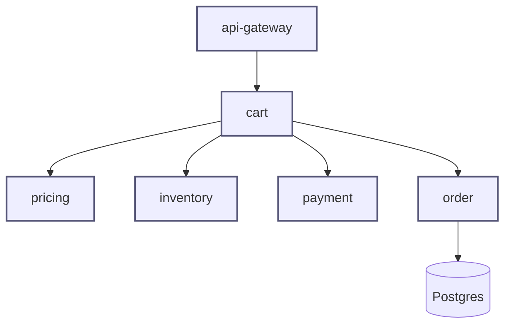

# Architecture — checkout (RETROFIT)

A team runs an unguarded retrofit agent against a four-year-old in-house checkout service. The original architects have left; no preserved decision records, no ADRs, no design documents survive the migration off the previous wiki. The agent produced this document.

## Counter-example — what NOT to do

This artifact exhibits the three retrofit-laundering tells in concentrated form. Every inline `<!-- VIOLATION: ... -->` annotation marks what the matched review skill's hard-rejects would catch. After the laundered draft, a closing meta-note describes what the *honest* shape would look like.

## Overview

The checkout service is a well-architected, modular implementation of the order-checkout workflow that follows industry best practices for separation of concerns, single-responsibility, and domain-driven design.
<!-- VIOLATION: anti-pattern.laundered-architecture — every word of this overview reads as an apologetic for the current code. No architecture-as-hypothesis bet. No mention of any boundary that turned out to be wrong. No risks, no trade-offs, no honest uncertainty. -->
<!-- VIOLATION: anti-pattern.fabricated-decomposition-rationale — generic principle invocations ("industry best practices", "separation of concerns", "single-responsibility", "domain-driven design") with no specific decision record cited. -->

The five components below have been carefully designed to maximise extensibility, testability, and operational excellence.
<!-- VIOLATION: anti-pattern.fabricated-decomposition-rationale — "carefully designed", "maximise extensibility / testability / operational excellence" — boilerplate detached from any specific historical record or trade-off. -->

## Structure Diagram



A clean five-box drawing. Each component has one responsibility and clear arrows.
<!-- VIOLATION: anti-pattern.laundered-architecture — the drawing papers over the actual runtime mess. The real code shows: cart and pricing share a mutable `CheckoutContext` static singleton (src/main/.../CheckoutContext.java); inventory writes to the same `cart_lines` table that cart owns (db/migration/V019); the order component imports types from cart and from payment in a cycle (cart → order → cart through the OrderEvent listener, src/.../OrderEventListener.java:34). None of this is on the diagram. The diagram is a wish, not a description. -->
<!-- VIOLATION: anti-pattern.laundered-architecture — no separation between internal and external (PSP, event bus, downstream consumers all missing); no persistent-store visibility beyond a single Postgres box; no failure-domain or trust-zone boundaries. The diagram suppresses everything that would make the artifact useful. -->

## Decomposition

```yaml
decomposition:
  - id: cart
    purpose: "Manages shopping cart and orchestrates checkout."
    responsibilities:
      - "Manage cart state with clean separation of concerns."
      - "Coordinate with pricing and inventory following DDD principles."
      - "Orchestrate the checkout workflow."
    allocates: [REQ-001, REQ-002]
    recovery_status: reconstructed                # ← VIOLATION (refusal A): rationale field marked as if recoverable
    rationale: "Chosen because it adheres to the single-responsibility principle and provides clean bounded-context separation, following DDD best practices."
    # <!-- VIOLATION: anti-pattern.fabricated-decomposition-rationale -->
    # Three tells of fabrication, all present:
    #   (a) "single-responsibility principle" — generic principle, no historical recall.
    #   (b) "clean bounded-context separation" — DDD boilerplate, no link to any
    #       specific linguistic fracture in this codebase.
    #   (c) "following DDD best practices" — name-drop, no specific decision record.
    # The original team is gone; no design documents preserved; this rationale
    # was synthesised from training priors. A future reader will cite
    # "DDD best practices" as the source of a decision the original team
    # never made.

  - id: pricing
    purpose: "Calculates prices following industry-standard discounting and tax algorithms."
    responsibilities:
      - "Compute totals with appropriate accuracy."
      - "Handle discounts and promotions in a maintainable manner."
    allocates: [REQ-005]
    recovery_status: reconstructed                # ← VIOLATION: refusal A
    rationale: "Implemented with clean architecture in mind, balancing flexibility and performance."
    # <!-- VIOLATION: anti-pattern.fabricated-decomposition-rationale -->
    # "industry-standard", "appropriate accuracy", "maintainable manner",
    # "clean architecture in mind", "balancing flexibility and performance" —
    # five generic phrases in two lines. Could be applied to any pricing
    # component in any codebase. None of them say what was actually decided
    # or why this boundary was drawn here rather than (e.g.) inside cart.

  - id: inventory
    purpose: "Reserves and releases stock with high reliability."
    responsibilities:
      - "Reserve stock when needed."
      - "Release stock when appropriate."
    allocates: [REQ-010]
    recovery_status: reconstructed                # ← VIOLATION: refusal A
    rationale: "Designed for high cohesion and low coupling, following SOLID principles."
    # <!-- VIOLATION: anti-pattern.fabricated-decomposition-rationale -->
    # SOLID name-drop. The actual code (db/migration/V019) shows that
    # inventory writes to cart_lines, which is owned by the cart schema —
    # the rationale claims the opposite of what the code does. This is
    # how laundered rationale obscures real design debt.

  - id: payment
    purpose: "Handles payment processing through industry-standard interfaces."
    responsibilities:
      - "Process payments securely."
      - "Handle refunds and authorisations."
    allocates: [REQ-020]
    recovery_status: reconstructed                # ← VIOLATION: refusal A
    rationale: "Best-practice integration layer for payment processing, following PCI-DSS guidance."
    # <!-- VIOLATION: anti-pattern.fabricated-decomposition-rationale -->
    # "industry-standard", "best-practice", "PCI-DSS guidance" — citation by
    # name-drop. No specific PCI-DSS section referenced. No record of which
    # PSP was chosen, when, or why. The actual code reveals tokenisation
    # happens server-side, which is the opposite of PCI-DSS best practice
    # (the rationale launders a known compliance gap).

  - id: order
    purpose: "Persists orders and emits events to consumers."
    responsibilities:
      - "Save the order."
      - "Emit events for downstream systems."
    allocates: [REQ-025]
    recovery_status: reconstructed                # ← VIOLATION: refusal A
    rationale: "Single-responsibility commit handler, following clean separation of concerns."
    # <!-- VIOLATION: anti-pattern.fabricated-decomposition-rationale -->
    # The actual code has order importing types from cart and emitting via
    # a listener that imports back into cart (cyclic dependency,
    # src/.../OrderEventListener.java:34). The rationale claims "single-
    # responsibility" and "clean separation" — the opposite of what the
    # code shows.
```

## Interfaces

(Elided for brevity in this counter-example. The laundered version would carry interface entries with similarly fabricated rationale and would omit pre/post/invariants entirely or fill them with platitudes.)

## Composition

The system follows a layered architecture with clear separation of concerns. Components communicate via well-defined interfaces, ensuring loose coupling and high cohesion.
<!-- VIOLATION: anti-pattern.ad-hoc-composition — no named runtime pattern (request-response? event-driven? saga?), no wiring concerns (DI strategy, middleware order, message-bus topology), no sequence diagram. "Layered architecture with clear separation of concerns" is the canonical hand-wave. -->
<!-- VIOLATION: anti-pattern.missing-composition-spec — at root scope, deployment intent is required (environments, orchestration target, runtime-unit boundaries). None present. Hard refusal C in SKILL.md applies. -->

## Notes — what is missing (the laundering by omission)

- **No `recovery_status: unknown` anywhere.** Every rationale field claims `reconstructed`. The honest answer for every rationale here is `unknown` — there is no preserved decision record.
- **No Gap report.** Lost rationale is not flagged. Structural drift (the cycles, the shared mutable state, the cross-schema writes) is not reported. Missing ADRs are not stubbed.
- **No follow-up owners.** The unknowns that *should* be marked aren't there at all, so there are no `@owner` queues.
- **No file/line citations.** The rationale claims observed structural alignment with principles; the structural fields make no reference to any file, line, commit, or schema.

## What the *honest* shape would look like instead

A retrofit done correctly against the same code would produce the same component list (cart, pricing, inventory, payment, order — those boundaries actually exist in the code), but every rationale field would be:

```yaml
rationale:
  status: unknown
  note: |
    No preserved decision record. Git history shows boundary stable since
    commit abc123 (2021-06); no commit message cites a motivating decision.
  follow_up:
    owner: "@original-lead"
    action: "Confirm whether this boundary was deliberate; if yes, supply rationale; if no, propose redecomposition."
```

The structural fields would carry file/line evidence:

```yaml
responsibilities:
  - "Line-item state (observed: src/main/.../CartService.java:142-198)"
  - "Calls PricingClient on every update (observed: src/main/.../CartService.java:240)"
```

The Gap report section would call out, by name and citation, the four real defects the laundered version hides:

- `CheckoutContext` static singleton (cart + pricing share mutable state — `src/.../CheckoutContext.java`); rationale unknown; structural debt; redecomposition candidate.
- Cross-schema write (inventory writes to cart-owned `cart_lines` — `db/migration/V019`); strong consistency boundary smear.
- Cyclic dependency cart ↔ order (`src/.../OrderEventListener.java:34`); fitness-function failure on dependency direction.
- Server-side tokenisation in payment component (`src/.../PaymentTokeniser.java`); compliance review needed.

The Composition section would name a real runtime pattern (whatever the running system actually is) plus the wiring that exists (the singleton, the listener, the cross-schema writes), even though that shape is uncomfortable. *Honest retrofit makes the discomfort visible. Laundering hides it behind a clean diagram and competent-sounding boilerplate.*

The four findings above are precisely the value a retrofit Architecture is supposed to surface. The laundered version surfaces none of them — that is what makes it worse than no Architecture at all: it crowds out the truth with a confident-sounding fiction.
