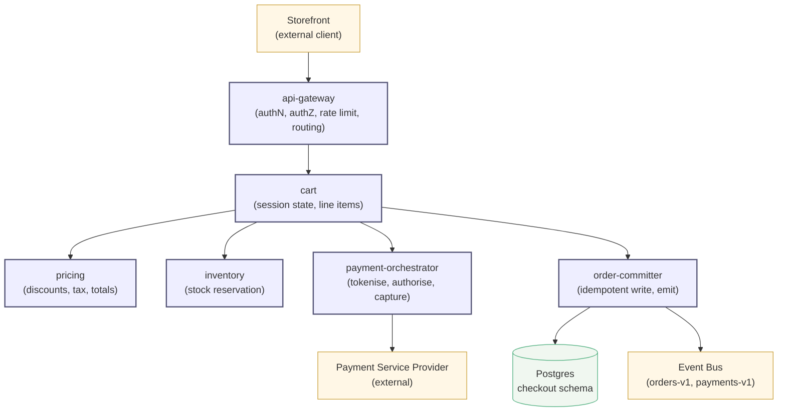
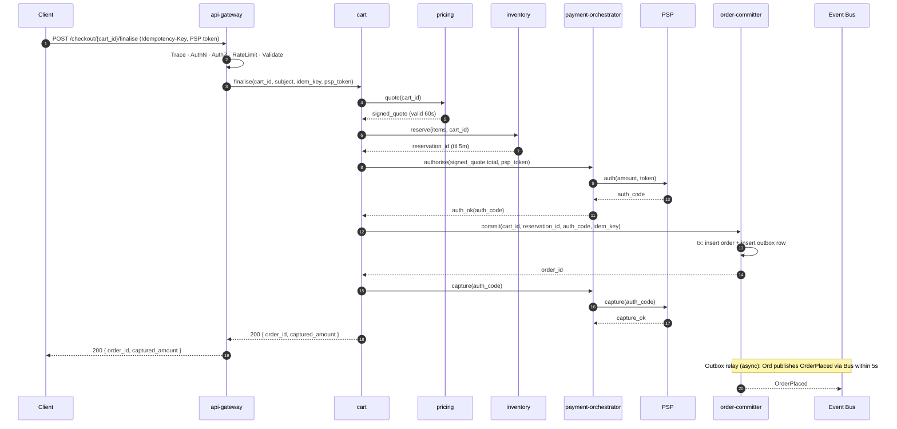
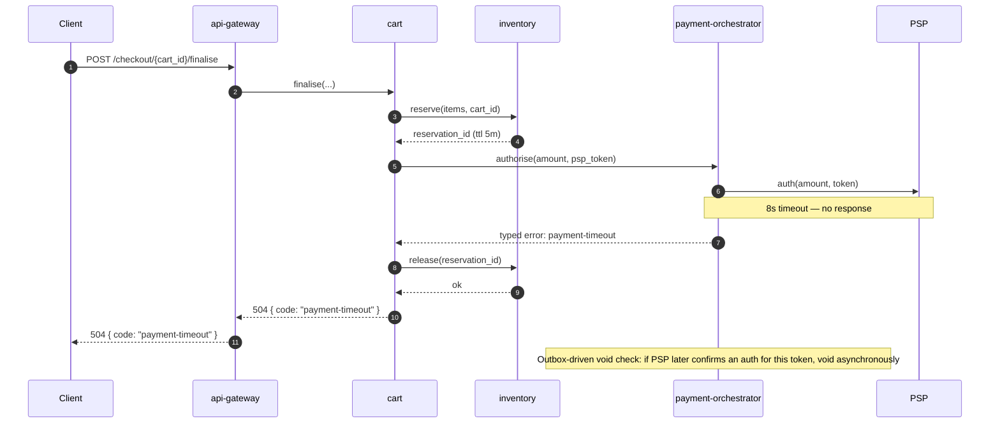
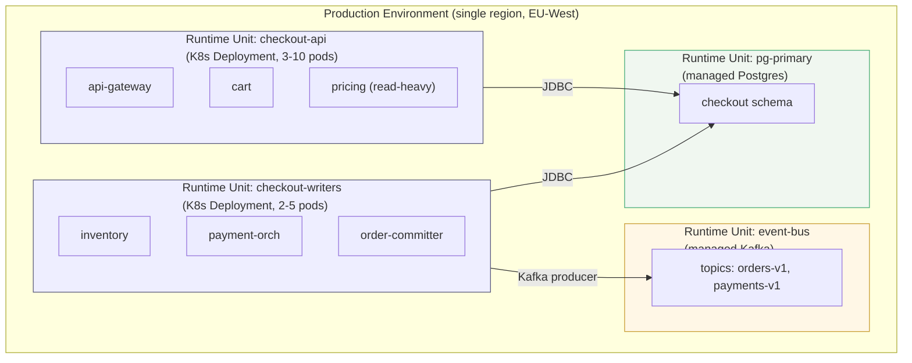

# Architecture — checkout

## Overview

The checkout scope owns the path from a populated cart to a committed order: line-item state, deterministic pricing, inventory reservation, payment authorisation and capture against an external Payment Service Provider, and the idempotent order commit that emits downstream events. The scope's parent is the e-commerce platform root; this Architecture is the root-scope artifact and therefore carries deployment intent.

The architecture-as-hypothesis bet for this scope: *we expect cart, pricing, and inventory to remain coupled to the same deploy cadence (one team, one ship), while the payment-orchestrator and order-committer scale and fail independently because their workloads (PSP-bound latency, transactional throughput) diverge sharply from the read-heavy front of the checkout workflow.* The bet motivates the runtime-unit split below; future teams have a place to record when the bet broke.

The Composition section names a request-response pattern with an outbox-relay for asynchronous event publication. The synchronous path returns the order id and captured amount to the client; the OrderPlaced event reaches the bus within five seconds via the outbox. This split is the load-bearing decision of the artifact: it lets the synchronous response carry a strong guarantee (HTTP 200 implies the order was committed) while decoupling the event-bus availability from that guarantee.

## Structure Diagram



The internal region holds the gateway and five components (`cart`, `pricing`, `inventory`, `payment-orchestrator`, `order-committer`). The storefront client, the PSP, and the event bus are external and drawn outside. The Postgres `checkout` schema is the only persistent store at this scope. Happy-path flow reads top-to-bottom: client → gateway → cart, with cart fanning out to pricing / inventory / payment / order-committer and the order-committer writing to DB and emitting on the bus.

## Decomposition

```yaml
decomposition:
  - id: cart
    purpose: "Session-lived container for line items and checkout progress."
    responsibilities:
      - "Hold the customer's line items, coupons, and selected shipping option."
      - "Orchestrate the checkout workflow across pricing, inventory, payment, order."
      - "Emit checkout-session lifecycle events (started, updated, abandoned)."
    allocates: [REQ-001, REQ-002, REQ-014, REQ-017]
    likely_change_driver: "shipping-option model evolves (international, locker, same-day)"
    bounded_context_line: "checkout vs catalogue (cart owns line-item snapshot, not catalogue identity)"
    owning_team_type: "stream-aligned"
    test_seam:
      driving_ports: [HttpFinalise, HttpUpdate]
      driven_ports: [PricingPort, InventoryPort, PaymentPort, OrderPort]
    rationale: |
      Cart is the orchestration boundary. The single change-driver test passes:
      shipping-option changes are absorbed here without touching pricing tax
      logic or inventory reservation semantics. Per ADR-008, authn lives at
      the gateway; cart trusts the subject claim and enforces ownership.

  - id: pricing
    purpose: "Deterministic total calculation given line items, customer context, and active promotions."
    responsibilities:
      - "Compute line totals, discounts, taxes, shipping, grand total."
      - "Return a signed price quote with a validity window."
      - "Source promotion rules and tax rates from the pricing-rules read store."
    allocates: [REQ-005, REQ-006, REQ-007]
    likely_change_driver: "tax jurisdiction rules add or change (regulatory)"
    bounded_context_line: "pricing rules vs cart workflow (rule data is its own model)"
    owning_team_type: "stream-aligned"
    test_seam:
      driving_ports: [PricingPort]
      driven_ports: [PricingRulesReadPort]
    rationale: |
      Pricing is a pure function over (lines, customer, time) plus the rules
      read store. The signed quote is the published contract back to cart —
      the validity window is what makes the synchronous path safe (cart
      cannot accidentally re-price during the same finalise call).

  - id: inventory
    purpose: "Authoritative stock reservation and release."
    responsibilities:
      - "Reserve inventory atomically against a cart's line items."
      - "Release reservations on abandonment or on order failure."
      - "Expose current availability reads for pre-checkout UI hints."
    allocates: [REQ-010, REQ-011]
    likely_change_driver: "reservation TTL policy changes per fulfilment partner"
    bounded_context_line: "inventory state vs catalogue (stock counts move; SKU identity does not)"
    owning_team_type: "stream-aligned"
    test_seam:
      driving_ports: [InventoryPort]
      driven_ports: [StockStorePort]
    rationale: |
      Inventory is the only component with strong-consistency requirements
      on its own writes (reserve must be atomic). Per ADR-019, reservations
      live in the same Postgres cluster as orders so the reservation→commit
      path can be a single transaction. The TTL is a deliberate timeout
      so that abandoned carts release their hold without a cleanup job.

  - id: payment-orchestrator
    purpose: "Boundary with the payment service provider; tokenisation, authorisation, capture."
    responsibilities:
      - "Exchange raw card input for a PSP token at the browser boundary."
      - "Authorise the token against an amount; handle PSP errors with typed codes."
      - "Capture on order commit; void on failure."
    allocates: [REQ-020, REQ-021, REQ-022]
    likely_change_driver: "secondary PSP onboarded for resilience or geographic coverage"
    bounded_context_line: "PSP integration (Anticorruption Layer for the PSP's vocabulary)"
    owning_team_type: "stream-aligned"
    test_seam:
      driving_ports: [PaymentPort]
      driven_ports: [PspClientPort]
    rationale: |
      ACL with the PSP per DDD context-mapping — the PSP's vocabulary and
      error model are quarantined here. Tokenisation happens at the browser
      boundary (the orchestrator never sees raw card data); the orchestrator
      handles only PSP tokens. This is the boundary where PSP failures
      become typed errors the rest of the scope can handle.

  - id: order-committer
    purpose: "Idempotent write of the finalised order; emit downstream events."
    responsibilities:
      - "Write the Order aggregate in a single transaction with outbox events."
      - "Produce an OrderPlaced event on the bus after transaction commit."
      - "Retry-safe under duplicate submission via the idempotency key."
    allocates: [REQ-025, REQ-026, REQ-028]
    likely_change_driver: "downstream consumers added (loyalty, fulfilment, analytics)"
    bounded_context_line: "order finalisation vs cart workflow (the order is its own aggregate)"
    owning_team_type: "stream-aligned"
    test_seam:
      driving_ports: [OrderPort]
      driven_ports: [OrderRepoPort, OutboxPort]
    rationale: |
      Per ADR-012, idempotency-key under at-least-once delivery is the
      contract clients rely on. Per ADR-019, the outbox-relay pattern
      decouples bus availability from the synchronous write path: tx
      commit + outbox row in the same transaction; relay process emits
      asynchronously within 5s.
```

The one-sentence-responsibility test passes for every child (no hidden *and*s). Every parent-allocated requirement (REQ-001 through REQ-028 except those at platform scope) lands in at least one child's `allocates`. The change-blast test fired during decomposition: an earlier draft folded `order-committer` into `cart`, but adding loyalty consumers cascaded into cart's responsibility surface — splitting it absorbed the change-driver cleanly.

## Interfaces

```yaml
interfaces:
  - name: ICartFinaliseCheckout
    from: api-gateway
    to: cart
    protocol: "HTTP/1.1 over TLS 1.3 + JSON (REST)"
    contract:
      operation: "POST /checkout/{cart_id}/finalise"
      preconditions:
        - "Cart exists and is in state ACTIVE or PRICED."
        - "Authenticated session's subject owns the cart (subject claim from ADR-008 gateway authN)."
        - "Idempotency-Key header present and globally unique per 24h window."
        - "Request body carries the PSP token previously obtained at the browser boundary."
      postconditions:
        on_success:
          - "Order is committed; an OrderPlaced event is published within 5s (outbox relay, ADR-019)."
          - "Cart transitions to state COMPLETED; no further operations accepted."
          - "Response 200 carries { order_id: UUID, captured_amount: { value, currency } }."
        on_precondition_failure:
          - "HTTP 4xx returned with typed error code (cart-state, auth, idempotency-collision)."
          - "No state mutation; cart remains in its prior state."
        on_downstream_failure:
          - "HTTP 502 or 504 returned with typed error code (inventory-unavailable, pricing-stale, payment-declined, payment-timeout)."
          - "Cart state unchanged; any in-flight inventory reservation released within 30s."
          - "Any PSP authorisation that succeeded but did not commit is voided within 60s."
      invariants:
        - "Double submission with the same idempotency key returns the first response body byte-for-byte and does not re-commit."
        - "If HTTP 200 is returned, the OrderPlaced event is guaranteed to be published (outbox guarantee — at-least-once)."
        - "Read-only against cart state when status is COMPLETED — no further finalise call can mutate."
      errors:
        - { code: "cart-state",            http: 409, meaning: "Cart is not in a finalisable state." }
        - { code: "auth",                  http: 403, meaning: "Session subject does not own the cart." }
        - { code: "idempotency-collision", http: 409, meaning: "Idempotency key already seen with different payload." }
        - { code: "inventory-unavailable", http: 502, meaning: "Reservation could not be completed." }
        - { code: "pricing-stale",         http: 502, meaning: "Signed quote has expired; client must re-price." }
        - { code: "payment-declined",      http: 502, meaning: "PSP refused authorisation." }
        - { code: "payment-timeout",       http: 504, meaning: "PSP did not respond within 8s." }
      quality_attributes:
        availability:        "99.9% monthly per platform SLO (REQ-051)."
        latency:             "p95 ≤ 1200 ms under nominal load (REQ-052); allocated as gateway 50 ms + cart orchestration 100 ms + pricing 100 ms + inventory 100 ms + PSP authorise budget 800 ms + commit 50 ms + buffer 100 ms."
        idempotency_window:  "24 hours from first observation of the key."
      authentication: "Bearer-token JWT (per ADR-008); validated at api-gateway (gateway-evaluation layer); claims propagated to cart as `subject`."
      authorisation:  "Cart ownership enforced in cart's middleware layer; gateway does not see cart state."
      rationale: |
        REST over JSON chosen for the gateway boundary (per ADR-008 — universal
        client tooling, cache-friendly, evolves additively). Idempotency key
        mandated by REQ-028 and ADR-012 (at-least-once delivery from unreliable
        clients; client may retry the same finalise request and must not
        double-commit). Synchronous response chosen because the user is
        waiting; outbox relay decouples bus availability so HTTP 200 carries
        a strong commit guarantee independent of bus health.
    version: "1.0.0"
    deprecation_policy: "Breaking changes increment MAJOR; both v1 and v(N+1) live in parallel for a minimum of 12 months from v(N+1) GA announcement; deprecation window communicated via API gateway changelog."
```

## Composition

### Runtime pattern

**Request-response with outbox-relay for async events.** The synchronous path (client → gateway → cart → pricing/inventory/payment/order-committer → response) carries the user's wait. The outbox-relay path (order-committer → bus) carries downstream notifications. The split is load-bearing: HTTP 200 implies commit (visible to the client immediately); the bus carries OrderPlaced asynchronously with at-least-once semantics. Pattern rationale: per ADR-019, this combination gives synchronous order confirmation without coupling availability to the event bus.

### Wiring

- **DI strategy:** Constructor injection at composition root. Each component (cart, pricing, inventory, payment-orchestrator, order-committer) has a single `WiringModule` that constructs concrete adapters for its driven ports and registers them in the IoC container. No service locator; no field injection. Adapters substitutable for in-memory fakes in tests.
- **Middleware stack (in order at the gateway):**
  1. Tracing (W3C TraceContext propagation, sampling at 100% errors + 1% successes)
  2. AuthN (JWT bearer validation per ADR-008)
  3. AuthZ (gateway-level coarse-grained checks; tenant claim required)
  4. RateLimit (per-tenant + per-IP, sliding window)
  5. Request-validation (schema check)
  6. Handler dispatch
- **Message-bus topology (managed Kafka):**
  - Topics: `orders-v1`, `payments-v1`
  - Partition key: `order_id` (preserves per-order ordering)
  - Retention: `orders-v1` 30 days; `payments-v1` 7 days
  - Dead-letter routing: per-topic DLQ with TTL 14 days; consumer groups isolated by downstream service
  - Schema-evolution policy: additive-only within v1; breaking changes via topic versioning (`orders-v2`) with v1 retained for 12 months

### Sequence diagrams

#### Happy path



Five observations make this Composition load-bearing. (1) The gateway's middleware stack is stated explicitly on the edge — not "the gateway does its thing". (2) The pricing quote is signed with a validity window — the pricing → cart interaction is a published contract. (3) The inventory reservation is a first-class artifact with TTL, with explicit release on failure. (4) Order commit is transactional with the outbox row in the same transaction — the invariant "if HTTP 200, OrderPlaced is published" is maintainable precisely because of this. (5) The PSP is drawn outside the boundary and treated as a potential failure point (see failure-path diagram below).

#### Critical failure path: PSP timeout



The compensation path releases the inventory reservation before returning 504. Cart state is unchanged. The asynchronous void-check guards against the case where the PSP's response was lost in transit but the authorisation succeeded.

### Deployment intent

**Environments:** `dev` (single-replica, in-cluster Postgres, sandbox PSP, ephemeral Kafka), `staging` (production-shape, anonymised data, sandbox PSP, separate Kafka cluster), `production` (single-region EU-West, live PSP, managed Postgres + Kafka). Differences are limited to scale, data set, and PSP environment — no behavioural divergence.

**Orchestration target:** Kubernetes (managed EKS), nginx ingress, no service mesh at this scope. Rationale: the team already operates an EKS estate; the additional operational primitives a service mesh would buy (mTLS, traffic shifting) are not yet load-bearing for this single-region deployment.

**Runtime units:**



Four runtime units. `checkout-api` is read-heavy (the gateway, cart orchestration, and pricing); `checkout-writers` carries the writer workload (inventory reservation, PSP calls, order commit). Splitting them is deliberate — pricing's scaling curve (promotion storms) differs from the order committer's, and a bad day on pricing should not starve the committer's connection pool. The DB and bus are explicit runtime units so failure domains are visible.

**IaC:** Terraform for managed services (Postgres, Kafka, EKS) lives in `infra/terraform/checkout/`. Kubernetes manifests live in `infra/k8s/checkout/`; Helm charts in `infra/helm/checkout/`. Capacity numbers (pod counts, Postgres instance size, Kafka partition counts) live in IaC, not here. This Architecture specifies the unit-boundary structure; capacity changes go through IaC, structural changes go through this artifact.

**12-factor stance:** applied unmodified — config in env, processes disposable, logs as streams, dev/prod parity, port binding. No departures.

**Cost:** envelope ≤ €18k/month at production; cost-per-finalise target ≤ €0.012; cost-of-a-9 from 99.9% to 99.95% would require multi-AZ Postgres and Kafka replication and is explicitly out of scope at this iteration (would breach envelope by ~€7k/month).

## Quality attributes (allocated)

| Parent NFR | Lands at |
|---|---|
| REQ-051 (99.9% monthly availability) | Composition-level cross-cutting commitment; allocated to `ICartFinaliseCheckout.quality_attributes.availability`; production runtime units have failure-domain redundancy at pod level (3+ replicas per RU) |
| REQ-052 (p95 ≤ 1200 ms end-to-end) | `ICartFinaliseCheckout.quality_attributes.latency`; budget breakdown stated in interface entry |

## Resilience

- **Bulkheads:** per-downstream connection pools — separate pool for PSP (cap 50 concurrent), pricing-rules read store (cap 100), Postgres (cap 100). One slow dependency cannot starve the global pool.
- **Circuit breakers:** at the PSP boundary (open at 50% error rate over 60s; half-open with 5 probes); at pricing → pricing-rules read store (open at 30% over 60s).
- **Retry policy:** PSP auth retried 0 times (auth is idempotent against the same token but a retry surfaces as a duplicate authorisation in audit; surface 504 to caller instead). Postgres write idempotent under unique idempotency key — retried up to 2 times with 50 ms exponential backoff + full jitter. Bus publish idempotent under outbox dedup key — retried up to 5 times with exponential backoff + full jitter, then DLQ.
- **Graceful degradation:** loyalty-points lookup at checkout is non-essential — degraded by omission (checkout proceeds without loyalty annotation; loyalty is awarded post-commit via the OrderPlaced event downstream).
- **Failure domains:** pod (single replica fails — others absorb); AZ (single AZ outage — Postgres and Kafka are multi-AZ managed); region (out of scope at this iteration; documented as cost trade-off above).
- **Redundancy independence:** pod replicas share the same binary and same Postgres connection pool — *not* independent against bugs in the binary or pool exhaustion. Independence is at the AZ level for Postgres and Kafka (managed multi-AZ) only.

## Observability + security

**Telemetry:** OpenTelemetry instrumentation. Common context fields: `request_id`, `tenant_id`, `subject`, `correlation_id`, `cart_id` (where present), `order_id` (where present). Sampling: 100% errors, 1% successes. SLO-bearing metrics: `finalise_latency_ms_p95`, `finalise_availability_30d`. Diagnostic: `psp_circuit_state`, `inventory_reservation_release_lag_seconds`, `outbox_relay_lag_seconds`.

**Trust zones:** internet (untrusted) → gateway (TLS termination, authN) → internal mesh (authenticated, mTLS via cluster network policy) → service process (trusted, holds secrets in memory only). STRIDE controls per crossing — internet→gateway: TLS for tampering + info-disclosure, JWT validation for spoofing, rate-limit for DoS, authZ at handler for elevation.

**Authn / authz at every externally callable interface:** JWT bearer at gateway; cart ownership in cart's middleware; PSP credentials held in payment-orchestrator only.

**Secrets:** PSP API key — origin: AWS Secrets Manager → in-memory holders: payment-orchestrator only → bearer-only: never (the orchestrator is the bearer) → forbidden surfaces: logs, metrics, traces, exception messages. Database credentials similar via IAM-rotated managed secret.

## Evolution + fitness functions

| Property | Classification | Check |
|---|---|---|
| Dependency direction (cart must not import payment-orchestrator's PSP-facing types) | Atomic + triggered | ArchUnit rule in CI |
| `ICartFinaliseCheckout` p95 ≤ 1200 ms | Atomic + continuous | Synthetic load probe; alert on rolling 7-day regression |
| Outbox relay lag ≤ 5s p99 | Atomic + continuous | Production metric + alert |
| No plaintext secret in config or env-export | Atomic + triggered | SAST rule in CI |
| Cart total LOC ≤ 5000 | Atomic + triggered | Static analysis threshold; warn at 4000, fail at 5000 |

No strangler-fig migration in play (greenfield).

## Notes

- Every decomposition entry, interface, and load-bearing composition choice carries rationale grounded in a specific ADR, requirement, or named trade-off. No generic-principle invocations.
- Spec Ambiguity Test: a junior engineer reading this artifact (with ADR-008, ADR-012, ADR-019 and parent Requirements) can derive defensible Detailed Designs for cart, pricing, inventory, payment-orchestrator, and order-committer; can write integration tests that verify every interface clause and the outbox guarantee; and does not need to ask clarifying questions about the request-response + outbox-relay split. Test passes.
