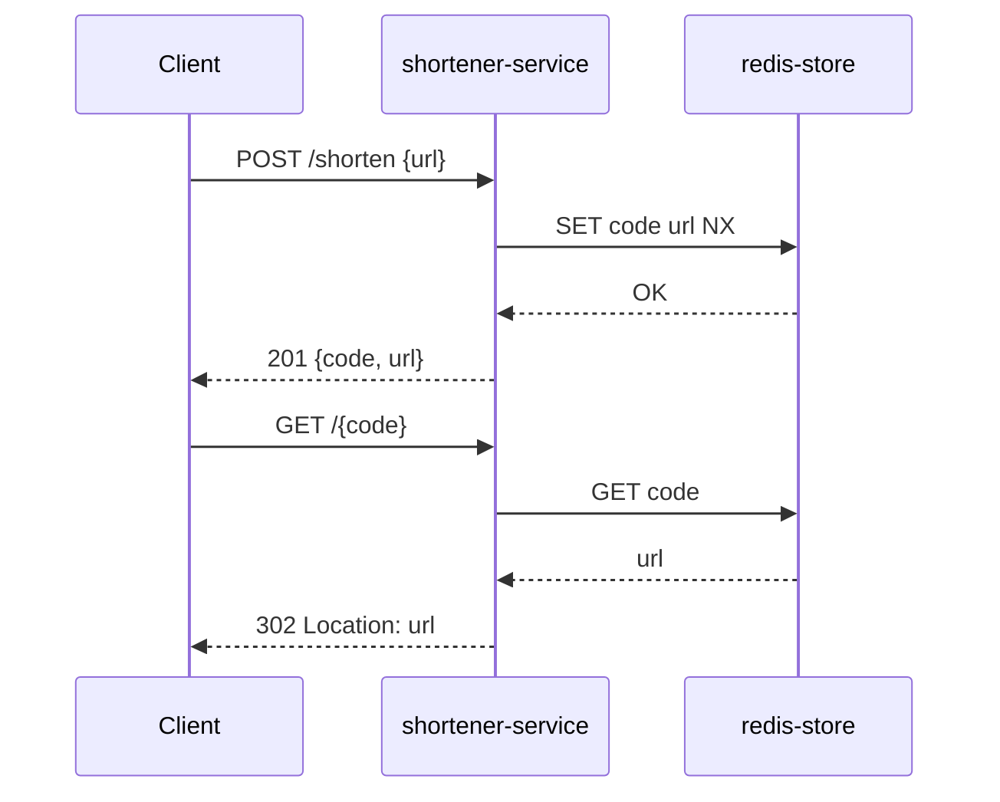

## Overview

The URL Shortener is structured as two collaborating components: an API layer
that handles HTTP requests, and a storage layer backed by Redis. All state lives
in Redis; the API layer is stateless and horizontally scalable.

## Structure Diagram

```
[Client] --> [api-gateway] --> [shortener-service] --> [redis-store]
```

## Decomposition

```yaml
id: shortener-service
purpose: "Accept shorten and resolve requests, enforce URL validation, and delegate persistence to redis-store."
responsibilities:
  - "Validate inbound URLs against RFC 3986."
  - "Generate and store short codes via redis-store."
  - "Resolve short codes to original URLs and return redirect responses."
allocates:
  - REQ-001
  - REQ-002
  - REQ-003
rationale: "Single-responsibility service boundary keeps URL logic isolated from storage concerns."
```

```yaml
id: redis-store
purpose: "Persist and retrieve short-code-to-URL mappings with sub-millisecond read latency."
responsibilities:
  - "Store short-code/URL pairs atomically."
  - "Return the URL for a given short code or indicate absence."
allocates:
  - REQ-002
  - REQ-003
rationale: "Redis provides the latency budget (p99 ≤ 50 ms) with its in-memory GET; persistence via AOF satisfies the no-data-loss constraint."
```

## Interfaces

```yaml
name: ShortenRequest
from: client
to: shortener-service
protocol: "HTTP/1.1 + JSON (REST)"
contract:
  operation: "POST /shorten"
  preconditions:
    - "Request body contains a non-empty 'url' string that is a valid HTTP or HTTPS URL."
  postconditions:
    on_success:
      - "Response is HTTP 201 with JSON body containing 'code' (≤10 chars, alphanumeric) and 'url' (the original URL)."
    on_precondition_failure:
      - "Response is HTTP 422 with body containing 'error: invalid-url'."
  errors:
    - code: invalid-url
      http: 422
      meaning: "The supplied URL is not a valid HTTP or HTTPS URL."
  quality_attributes:
    latency: "p99 ≤ 200 ms under 500 concurrent requests"
```

```yaml
name: ResolveRedirect
from: client
to: shortener-service
protocol: "HTTP/1.1 (REST)"
contract:
  operation: "GET /{code}"
  preconditions:
    - "Path parameter 'code' is a non-empty alphanumeric string of at most 10 characters."
  postconditions:
    on_success:
      - "Response is HTTP 302 with Location set to the original URL registered for this code."
    on_precondition_failure:
      - "Response is HTTP 404 with body containing 'error: code-not-found'."
  errors:
    - code: code-not-found
      http: 404
      meaning: "No URL is registered for the supplied short code."
  quality_attributes:
    latency: "p99 ≤ 50 ms under 500 concurrent requests (REQ-002)"
```

## Composition

Runtime pattern: **Layered Request-Response** — the client issues a synchronous
HTTP request; the API layer handles it in a single thread-pool task and returns
before releasing the connection. No async messaging in v1.



Middleware stack (in processing order): HTTP server → request validation →
code generation → Redis adapter.

DI strategy: constructor injection; the Redis adapter is injected at startup
via a composition root in `main`.

Deployment intent: single container image; Redis runs as a sidecar in
development and as a managed instance in production. Orchestration target:
Docker Compose (dev) / Kubernetes Deployment with 2 replicas (prod).

Integration-test targets: `shortener-service` against a real Redis instance
in a Docker Compose test environment.
