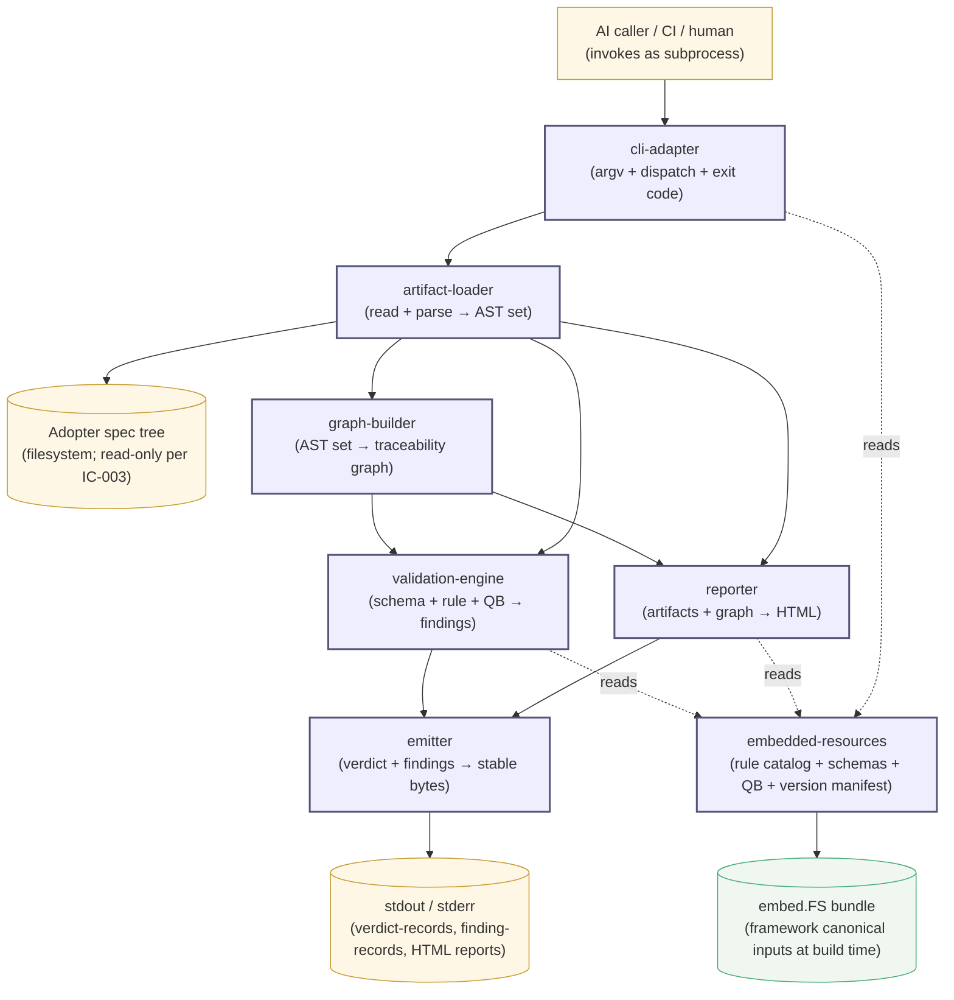
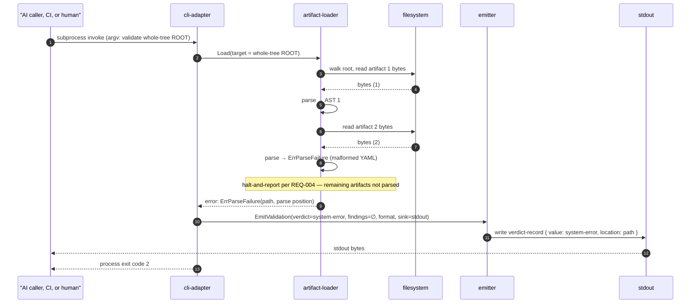
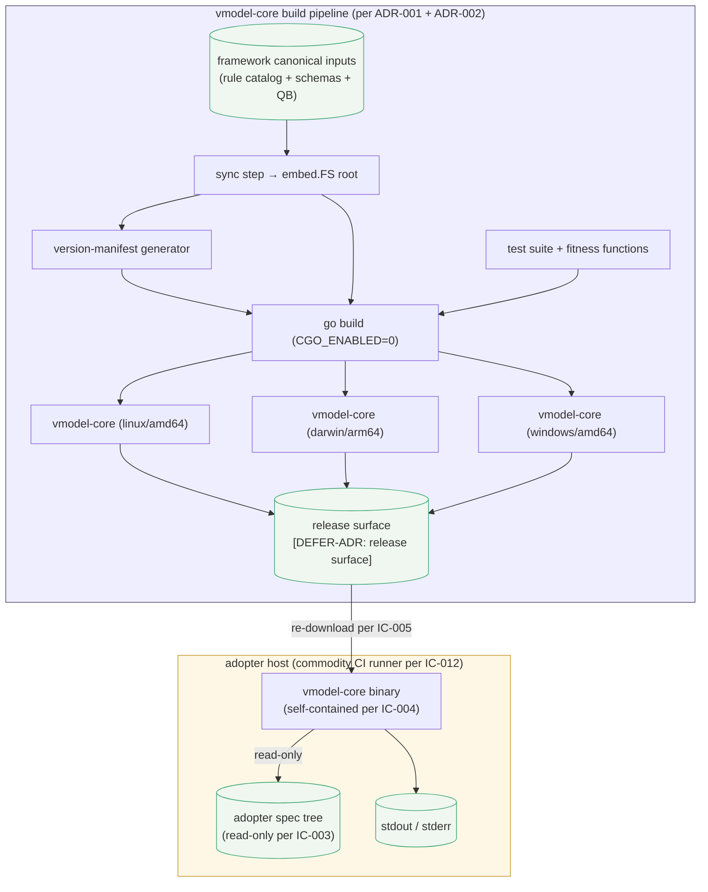

# Architecture — vmodel-core (root scope)

## Overview

Root-scope architecture for **vmodel-core** — the deterministic CLI that validates VModelWorkflow spec artifacts and reports on spec-tree state. Refines `specs/requirements.md` (REQ-001..REQ-032) under ADR-001 (Go) and ADR-002 (compile-time `embed.FS` bundling of the framework canonical rule catalog, schema set, and Quality Bar checklist set, no runtime override). vmodel-core is a child product of VModelWorkflow per `TARGET §10`; treated here as effective root because no parent-scope Architecture exists yet (`dogfood_findings.md` Issue 2).

**Architecture-as-hypothesis bet:** the embedded rule catalog, schema set, and Quality Bar checklist set evolve at framework cadence — propagated by re-download-and-replace per IC-005 — while parser, graph-builder, validation-engine, CLI surface, and emitter stay stable across multiple framework releases. The bet motivates `embedded-resources` as a distinct child and the rebuild-per-framework-release stance of ADR-002.

## Structure Diagram



Seven internal children. State lives in two places only: the adopter spec tree (read-only per IC-003) and the compile-time `embed.FS` bundle (immutable post-build per ADR-002). No runtime state between invocations (IC-002).

## Decomposition

```yaml
decomposition:
  - id: cli-adapter
    purpose: "Translate argv and stdin into an internal command, dispatch it, and render the resulting verdict-record or report descriptor with the matching exit code."
    responsibilities:
      - "Owns process-boundary translation: argv/stdin → internal command descriptor."
      - "Owns dispatch to validation-engine or reporter via in-process call."
      - "Owns verdict-to-exit-code mapping for both validation and reporter outputs (REQ-028)."
    allocates: [REQ-007, REQ-008, REQ-009, REQ-024, REQ-025, REQ-028, REQ-032]
    likely_change_driver: "CLI ergonomic shape evolves post-pilot per REQ-024 follow-up."
    rationale: "Sole owner of the hexagonal driving port; thin by design so the deferred CLI shape (REQ-024 follow-up) can evolve without rippling. Subcommand and flag structure: `[DEFER-DD: cli-adapter — subcommand and flag structure]`."

  - id: artifact-loader
    purpose: "Resolve a path/scope/tree input into a parsed artifact AST set, reading from the adopter's filesystem with read-only discipline."
    responsibilities:
      - "Owns the filesystem-read seam for the adopter spec tree (IC-003)."
      - "Owns Markdown + YAML 1.2 + embedded-YAML parsing into a structured artifact AST."
      - "Halts the run with a typed system-error condition on file IO failure or parse failure (REQ-004)."
    allocates: [REQ-007, REQ-008, REQ-009, REQ-015, REQ-016, REQ-021]
    likely_change_driver: "framework conventions for embedded blocks (Mermaid placement, YAML block tags) evolve."
    rationale: "Sole filesystem-touching component (IC-003); YAML library bound here per ADR-001 Propagation. Split from graph-builder isolates IO/parse failure modes (REQ-004) from pure in-memory graph computation."

  - id: graph-builder
    purpose: "Derive an in-memory traceability graph over a parsed artifact set, including cycle detection on the canonical link-type closure."
    responsibilities:
      - "Owns extraction of canonical traceability links from front-matter into a directed graph."
      - "Owns cycle detection on derived_from and supersedes (REQ-012); emits cycle findings consumed by validation-engine."
    allocates: [REQ-012, REQ-021]
    likely_change_driver: "framework adds a new canonical link type (currently nine per TARGET §7); graph schema evolves additively."
    rationale: "Shared infrastructure between validation-engine (rule evaluation) and reporter (REQ-021 impact-analysis). Splitting from validation-engine prevents reporter from re-implementing traversal. Rebuilt per invocation per IC-002."

  - id: validation-engine
    purpose: "Run schema, traceability-rule, and Quality Bar structural validations against the parsed artifact set and the traceability graph, producing a stream of finding-records."
    responsibilities:
      - "Owns evaluation of envelope + per-type schema (REQ-015, REQ-016)."
      - "Owns evaluation of all five rule-catalog categories (REQ-010..REQ-014)."
      - "Owns evaluation of Quality Bar structural items (REQ-017); sole producer of finding-records (REQ-006)."
    allocates: [REQ-004, REQ-006, REQ-010, REQ-011, REQ-012, REQ-013, REQ-014, REQ-015, REQ-016, REQ-017, REQ-026]
    likely_change_driver: "framework adds new rules / schema / Quality Bar items at framework release cadence; consumed via embedded-resources without code change in many cases."
    rationale: "[DEFER-ADR: validation-engine internal split (one engine vs three sibling components)] Internal split into schema-validator / rule-evaluator / QB-runner is DD scope. JSON Schema library: `[DEFER-DD: validation-engine — JSON Schema 2020-12 validator library selection]`."

  - id: reporter
    purpose: "Produce one self-contained HTML report per requested report type (coverage / completeness / inventory / impact-analysis) over the parsed artifact set and traceability graph."
    responsibilities:
      - "Owns aggregation logic for the four v1 report types (REQ-018..REQ-021)."
      - "Owns HTML rendering; hands rendered HTML to the emitter."
    allocates: [REQ-018, REQ-019, REQ-020, REQ-021]
    likely_change_driver: "report types added beyond the four at v1; output formats beyond HTML may be added per requirements.md *Open gaps*."
    rationale: "html/template (stdlib) is the templating mechanism per ADR-001 Propagation — context-aware escape gives safe-by-default output. HTML structure: `[DEFER-DD: reporter — HTML report template structure]`."

  - id: emitter
    purpose: "Aggregate the finding stream from validation-engine, compute the verdict-record, and render the result to stdout in stable byte-order in the requested output format (JSON or text for validation; raw HTML for reports)."
    responsibilities:
      - "Owns verdict-record computation as a pure function of (finding stream, termination cause) per REQ-001..REQ-005."
      - "Owns the byte-stable-order discipline at emit boundary (REQ-029); sole producer of bytes on stdout."
      - "Owns output-format rendering (JSON / text per REQ-024; HTML pass-through for reports)."
    allocates: [REQ-001, REQ-002, REQ-003, REQ-005, REQ-024, REQ-027, REQ-029]
    likely_change_driver: "byte-stable ordering discipline tightens; output formats added beyond JSON / text."
    rationale: "Centralising stable-order emit and verdict computation at one boundary makes REQ-029 and REQ-001 cardinality auditable in one place; consequence of ADR-001 (Go map iteration randomised by language design)."

  - id: embedded-resources
    purpose: "Provide read-only access to the framework canonical rule catalog, schema set, and Quality Bar checklist set bundled into the binary at build time, plus the version manifest naming the bundled versions."
    responsibilities:
      - "Owns typed accessors over the embed.FS bundle (REQ-030)."
      - "Owns the build-time version manifest (REQ-032)."
      - "Refuses any access path outside the binary's compiled-in embed.FS (REQ-031)."
    allocates: [REQ-030, REQ-031, REQ-032]
    likely_change_driver: "framework releases bump bundled versions; vmodel-core's build pipeline syncs new versions for the next vmodel-core release."
    rationale: "First-class boundary per ADR-002. Pivot point of the architecture-as-hypothesis bet: framework cadence drives change here while the inner domain stays stable."
```

Every parent-allocated requirement (REQ-001..REQ-032) lands in at least one child's `allocates`. NFRs (REQ-022, REQ-023) are composition-level (end-to-end latency / scale); see *Quality attributes (allocated)*.

## Interfaces

```yaml
interfaces:

  # =========================================================================
  # External interfaces (process boundary)
  # =========================================================================

  - name: IValidationCLI
    from: "AI-caller / CI / direct-human-caller (external process)"
    to: cli-adapter
    protocol: "Process invocation over the OS standard process model (argv + stdin → stdout + stderr + exit code)."
    contract:
      operation: "vmodel-core <validation-subcommand> [flags] [path]  (subcommand and flag shape per [DEFER-DD: cli-adapter — subcommand and flag structure])"
      summary_postcondition: "Emits exactly one verdict-record (REQ-001) plus zero-or-more REQ-026-shaped finding-records on stdout with byte-identical output for byte-identical input (REQ-029); exit code 0 pass / 1 fail / 2 system-error per REQ-028."
      key_invariants: [REQ-029, IC-002, IC-003]
      rationale: "CLI subprocess shape per IC-006; sync request-response per IC-002 cold-start. Byte-stable output (REQ-029) is the load-bearing AI-caller-friendly property."
    detail: ./architecture/interfaces/IValidationCLI.md

  - name: IReportCLI
    from: "AI-caller / CI / direct-human-caller (external process)"
    to: cli-adapter
    protocol: "Process invocation over the OS standard process model (argv + stdin → stdout + stderr + exit code)."
    contract:
      operation: "vmodel-core <reporting-subcommand> [flags] [params]  (subcommand and flag shape per [DEFER-DD: cli-adapter — subcommand and flag structure])"
      summary_postcondition: "Emits one self-contained HTML document on stdout with byte-identical output for byte-identical input (REQ-029); exit code 0 on success / 2 on system-error (REQ-025 error_handling)."
      key_invariants: [REQ-029, IC-003, IC-002]
      rationale: "Shares CLI subprocess shape with IValidationCLI per IC-006. HTML output (REQ-025) targets human readers; JSON/text variants deferred per requirements.md *Open gaps*."
    detail: ./architecture/interfaces/IReportCLI.md

  # =========================================================================
  # Internal interfaces (cross-child)
  # All in-process Go calls; versioned with vmodel-core's overall MAJOR per
  # ADR-001 / REQ-024 (no separate semver per internal package boundary).
  # authn/authz on internal interfaces are n/a — in-process trust.
  # =========================================================================

  - name: IArtifactLoad
    from: cli-adapter
    to: artifact-loader
    protocol: "in-process Go call (driven port)."
    contract:
      operation: "Load(target ArtifactTarget) (ArtifactSet, error)  -- ArtifactTarget enumerates single-artifact / scope-rooted-subtree / whole-tree per REQ-007/008/009."
      summary_postcondition: "Returns an ArtifactSet with stable enumeration order keying REQ-029, or a typed error (ErrTargetUnreadable / ErrTargetNotFound / ErrParseFailure / ErrIOFailure) that halts the walk per REQ-004."
      key_invariants: [IC-003, REQ-031]
      rationale: "REQ-004 halt-and-report is bound at this interface so cli-adapter's error path stays simple. Three modes (REQ-007/008/009) collapse to one ArtifactTarget type — no per-mode entrypoint needed."
    detail: ./architecture/interfaces/IArtifactLoad.md

  - name: IGraphBuild
    from: cli-adapter
    to: graph-builder
    protocol: "in-process Go call (driven port)."
    contract:
      operation: "Build(set ArtifactSet) (TraceabilityGraph, []Finding, error)  -- builds graph and emits cycle findings inline per REQ-012."
      summary_postcondition: "Returns a TraceabilityGraph plus zero-or-more REQ-012 cycle findings in REQ-026 shape with stable enumeration (REQ-029); halts via ErrMalformedFrontMatter (system-error per REQ-004) on malformed input."
      key_invariants: [IC-002, REQ-029]
      rationale: "Cycle detection bound to graph build (one call) keeps REQ-012 a first-class graph property."
    detail: ./architecture/interfaces/IGraphBuild.md

  - name: IValidate
    from: cli-adapter
    to: validation-engine
    protocol: "in-process Go call."
    contract:
      operation: "Validate(set ArtifactSet, graph TraceabilityGraph, mode ValidationMode) (<-chan Finding, error)  -- streaming finding channel; closed on complete or halt."
      summary_postcondition: "Streams REQ-026-shaped findings on a channel that is closed on completion; halts with typed system-error per REQ-004 on downstream failure."
      key_invariants: [REQ-029, REQ-031, IC-002]
      rationale: "Channel matches Go idiom and lets emitter own stable ordering (REQ-029). Schema + rule-catalog + QB bundled into one Validate call because orchestration is one per-artifact / per-scope / per-tree pass."
    detail: ./architecture/interfaces/IValidate.md

  - name: IReport
    from: cli-adapter
    to: reporter
    protocol: "in-process Go call."
    contract:
      operation: "Report(set ArtifactSet, graph TraceabilityGraph, request ReportRequest) (HTMLDocument, error)"
      summary_postcondition: "Returns one self-contained HTML document (REQ-018..REQ-021) with byte-identical output for byte-identical input (REQ-029); typed errors (ErrUnknownReportType / ErrInvalidParameters) on precondition failure with no HTML emitted."
      key_invariants: [REQ-029, REQ-025]
      rationale: "[DEFER-ADR: reporter entrypoint shape (one entrypoint vs per-type)] Output-format extension (JSON/text variants per requirements.md *Open gaps*) deferred."
    detail: ./architecture/interfaces/IReport.md

  - name: IEmit
    from: "validation-engine, reporter"
    to: emitter
    protocol: "in-process Go call."
    contract:
      operation: |
        EmitValidation(verdict Verdict, findings <-chan Finding, format OutputFormat, sink io.Writer) error
        EmitReport(doc HTMLDocument, sink io.Writer) error
      summary_postcondition: "Emitted bytes are determined solely by inputs (REQ-029), in stable order keyed by (artifact path, location-within-artifact, rule identifier); halts with typed error (ErrInvalidVerdict / ErrUnsupportedFormat / ErrSinkWrite) and runs become system-error per REQ-004 on sink failure."
      key_invariants: [REQ-029]
      rationale: "Centralising stable-order emit at one interface realises REQ-029 + ADR-001's map-iteration consequence. Stable-ordering key (path + location + rule-id) is observable in REQ-029 acceptance test, so it is bound at architecture level."
    detail: ./architecture/interfaces/IEmit.md

  - name: IFrameworkResources
    from: "validation-engine, reporter, cli-adapter"
    to: embedded-resources
    protocol: "in-process Go call."
    contract:
      operation: |
        RuleCatalog() RuleCatalog
        Schema(artifactType ArtifactType) (Schema, error)
        EnvelopeSchema() Schema
        QualityBarChecklist(artifactType ArtifactType) (QBChecklist, error)
        Versions() VersionManifest
      summary_postcondition: "Returns build-time-bound content (REQ-030) including the VersionManifest (REQ-032), byte-identical across binary lifetime; ErrUnknownArtifactType on unknown types — bundle absence is a build-time failure (no runtime downstream)."
      key_invariants: [REQ-031, IC-007]
      rationale: "Per ADR-002, no runtime override exists — structural enforcement of IC-007 + IC-002. Five typed accessors hide embed.FS internals so the bundling mechanism can evolve without consumer-API change. Versions() is the single source of truth for REQ-032."
    detail: ./architecture/interfaces/IFrameworkResources.md
```

Eight interfaces total: two external, six internal. Consumer-side narrowing applied via Go's accept-side interface idiom.

## Composition

### Runtime pattern

**Pipeline within a hexagonal shell.** Hexagonal: `cli-adapter` is the driving port; `embedded-resources` (over compile-time `embed.FS`), the filesystem (inside `artifact-loader`), and stdout/stderr (inside `emitter`) are driven adapters. Pipeline orders the inner-domain runtime flow: `argv → load → graph → (validate | report) → emit → exit`.

Pattern is committed inline rather than ADR-extracted because it is single-scope (only vmodel-core uses it) and reversible at vmodel-core's expected size.

- **Hexagonal half:** embed.FS (ADR-002) and filesystem (IC-003) are substitutable at unit-test scope; in-memory fakes serve every inner-domain test, supporting AI-caller author retry loop iteration speed (REQ-022).
- **Pipeline half:** runtime flow is genuinely linear — no fan-out, no parallelism, no choreography — matching IC-002 stateless cold-start.

### Wiring

Constructor injection at a single composition root in `cmd/vmodel-core/main.go`. Root constructs the embedded-resources adapter, the filesystem adapter (stdlib `os.ReadFile` / `filepath.Walk` plus `goccy/go-yaml` per ADR-001), and the stdout adapter; passes them into inner-domain components by interface type. No service locator, no field injection, no DI container.

### Sequence diagrams

#### Happy path: single-artifact validation (AI-caller author retry loop, REQ-022's most latency-sensitive workflow)

```mermaid
sequenceDiagram
    autonumber
    participant Caller as "AI caller, CI, or human"
    participant CLI as cli-adapter
    participant Load as artifact-loader
    participant FS as filesystem
    participant Graph as graph-builder
    participant Val as validation-engine
    participant Res as embedded-resources
    participant Emit as emitter
    participant Out as stdout

    Caller->>CLI: subprocess invoke (argv: validate single-artifact PATH)
    CLI->>CLI: parse argv → ValidationMode + path
    CLI->>Load: Load(target = single-artifact PATH)
    Load->>FS: read file bytes
    FS-->>Load: bytes
    Load->>Load: parse YAML 1.2 + Markdown + embedded YAML
    Load-->>CLI: ArtifactSet (1 artifact)
    CLI->>Graph: Build(set)
    Graph-->>CLI: TraceabilityGraph + 0 cycle findings
    CLI->>Val: Validate(set, graph, mode = single-artifact)
    Val->>Res: RuleCatalog(), Schema(type), EnvelopeSchema(), QualityBarChecklist(type)
    Res-->>Val: bundled content
    Val->>Val: schema-validate · run rule classes · run QB structural
    Val-->>Emit: stream of finding-records (channel)
    Emit->>Emit: compute verdict; stable-sort findings
    Emit->>Out: write JSON or text bytes
    Out-->>Caller: stdout bytes
    CLI-->>Caller: process exit code (0 pass / 1 fail)
```

#### Critical failure path: unparseable artifact during whole-tree validation (system-error halt per REQ-004)



The two diagrams cover the temporal flow for the validation track. Per-call DbC content lives in the corresponding interface entries above; the diagrams add the cross-component sequence not visible from any single interface.

### Deployment intent (root scope only)

vmodel-core is a single-process CLI distributed as a binary. The load-bearing deployment-intent concern at this scope is the **build pipeline** — per ADR-002 it is the only point at which the framework canonical inputs are bundled into the binary.

- **Environments.** One — the adopter's host (developer workstation, commodity CI runner per IC-012, or AI-agent container). Adopter-host variability bound by IC-004 (Linux, macOS, Windows on x86-64 and arm64).

- **Build pipeline.**
  1. **Sync** framework-side JSON inputs (rule catalog, schema set, Quality Bar checklists) into the embed.FS root; version manifest generated from synced source versions per REQ-032.
  2. **Test** — Go test suite including the fitness-function tests under *Evolution + fitness functions*.
  3. **Cross-compile** via `CGO_ENABLED=0 go build` with `GOOS={linux,darwin,windows}` and `GOARCH={amd64,arm64}` per ADR-001 — produces statically-linkable single-file binaries (IC-004).
  4. **Publish** to a release surface — `[DEFER-ADR: build-pipeline release surface]` (candidates: GitHub Releases, brew, scoop). Binary signing also `[DEFER-ADR: build-pipeline binary signing]`.
  5. **Adopters consume** via re-download-and-replace per IC-005.

- **12-factor stance.** *Processes disposable* (IC-002); *dev/prod parity* (every adopter runs the same binary); *logs as streams* (stderr — see *Observability + security*). *Config* is argv + flags (environment-variable-driven config deliberately absent at v1 to foreclose IC-007 relaxation surface).



## Quality attributes (allocated)

| Parent NFR / IC | Lands at |
|---|---|
| **REQ-022** — p95 author-retry-loop latency (targets pending pilot calibration) | Composition-level p95 budget: cli-adapter (parse + dispatch) + artifact-loader (IO + parse) + graph-builder (compute) + embedded-resources (decode) + validation-engine (rule + schema + QB) + emitter (sort + serialise + write). Per-component split pending REQ-022 follow-up. |
| **REQ-023** — whole-tree artifact-count scale (targets pending pilot calibration) | Composition-level: graph-builder (O(N)) + validation-engine (O(N × R)) + reporter (O(graph depth × edges) for impact-analysis). Per-class scaling: `[DEFER-DD: validation-engine — per-rule-class scaling characteristics]`. |
| **IC-012** — commodity CI runner | Bounds REQ-022/023; test-environment for per-component p95 budget tests. |
| **IC-001** — no LLM in runtime path | Structurally enforced by the *static-import-scan* fitness function below. |
| **IC-002** — stateless cold-start | Realised by pipeline-within-hexagonal (no daemon, no shared state); enforced by IFrameworkResources / IArtifactLoad / IGraphBuild contract invariants. |
| **IC-003** — read-only on adopter spec tree | Realised by artifact-loader's IArtifactLoad contract + invariants on IValidationCLI / IReportCLI. |
| **IC-004** — single-artefact distribution | Realised at the build-pipeline cross-compile step (ADR-001). |
| **IC-005** — re-download-and-replace update | Realised by build-pipeline shape — every release is a complete new binary. |
| **IC-006** — CLI as stable contract | Realised by IValidationCLI + IReportCLI; versioning per REQ-024. |
| **IC-007** — no relaxation modes | Realised by ADR-002; structurally enforced at IFrameworkResources (no override entrypoint exists). |
| **IC-008** — open-source distribution | Architecture-neutral; satisfied at release-surface step (license decision pending per requirements.md *Open gaps*). |
| **REQ-029** — byte-identical output | Realised by emitter as sole producer of bytes; load-bearing invariant on IEmit; enforced by *re-run-and-diff* fitness function. |
| **REQ-030 / REQ-031 / REQ-032** | Realised by embedded-resources + IFrameworkResources + cli-adapter version-query path. |

## Resilience

vmodel-core has no remote dependencies, no shared resources to partition, and no async edges. The only resilience choice load-bearing at this scope:

- **Halt-and-report on partial failure** (per stakeholder commitment, needs.md turn 11; rationale at REQ-004). System-level failure during a multi-artifact run halts the run; remaining artifacts are not evaluated. System-error and findings live on different tracks; AI callers do not have to disambiguate "this artifact has findings" from "this artifact couldn't be evaluated".
- **Failure domain** is one OS process. If the process crashes, the run fails atomically and the adopter re-runs.

## Observability + security

- **Telemetry.** Stderr structured logs at INFO / WARN / ERROR; verbosity controlled by flags deferred to `[DEFER-DD: cli-adapter — subcommand and flag structure]`. No metrics, no traces, no external destination at v1. Per-line context: `run_id` (UUID per invocation), `mode`, `binary_version`. Sampling: 100%.

- **Trust zones.** Two — outside-the-binary (OS, adopter spec tree, argv, environment) and inside-the-binary (inner domain plus embed.FS). Zone boundary is the OS process boundary. vmodel-core asserts no identity, validates no identity, authorises nothing.

- **STRIDE — load-bearing controls only.**
  - *Tampering:* embed.FS bound at compile time; runtime tampering requires modifying the binary itself, addressed via `[DEFER-ADR: build-pipeline binary signing]`. Adopter spec tree is read-only per IC-003.
  - *Information disclosure:* vmodel-core emits content from the adopter's spec tree on stdout (verdict, findings, reports). This is the explicit purpose; the adopter is responsible for not running vmodel-core on data they will not emit.
  - *Denial of service:* the only DoS surface is "adopter feeds maliciously large or pathological spec tree". Bounded by IC-012; OOM or runaway surfaces as system-error per REQ-004.

- **Authn / authz.** OS file-permission-based; stated in IValidationCLI and IReportCLI contracts.

## Evolution + fitness functions

```yaml
fitness_functions:
  - property: "Determinism — byte-identical output for byte-identical input (REQ-029)."
    classification: "atomic + triggered (CI gate)"
    check: "run vmodel-core on a fixture spec tree twice; diff stdout byte-for-byte; fail on any difference. Covers JSON, text, and HTML tracks."

  - property: "No external schema or network access at runtime (REQ-031)."
    classification: "atomic + triggered (CI gate)"
    check: "run vmodel-core in a sandbox with no network egress and a filesystem mount restricted to the binary's own path plus a sandbox-resolvable adopter spec tree; assert validation and reporting complete on a sandbox-internal input."

  - property: "No LLM SDK imports anywhere in the binary (IC-001)."
    classification: "atomic + triggered (CI gate)"
    check: "static-import scan over the build target's full dependency graph; fail if any of {anthropic, openai, cohere, google generative AI, hugging-face client, ...} package is reachable from the cmd/vmodel-core entrypoint."

  - property: "AI-caller author retry loop p95 latency within budget (REQ-022)."
    classification: "atomic + continuous (CI benchmark; promote to gate once REQ-022 targets are calibrated)."
    check: "synthetic single-artifact-validate workload on commodity CI runner; track p95 across N runs; alert on rolling regression. Threshold pending REQ-022 follow-up."

  - property: "Per-child Go-package coupling and LOC bounds — preserves the architecture-as-hypothesis bet."
    classification: "atomic + triggered (CI gate)"
    check: "static analysis on each child's Go package — fail if a child's import set crosses a sibling-internal package (only public interface types may cross), or if any child exceeds its LOC threshold. Thresholds: <TBD>."

  - property: "Bundled-version queryability (REQ-032) — version manifest matches synced source versions."
    classification: "atomic + triggered (CI gate)"
    check: "build pipeline test — after sync, the generated VersionManifest's three version identifiers match the source-version metadata of the synced framework files."
```

No strangler-fig migration in play (greenfield).
