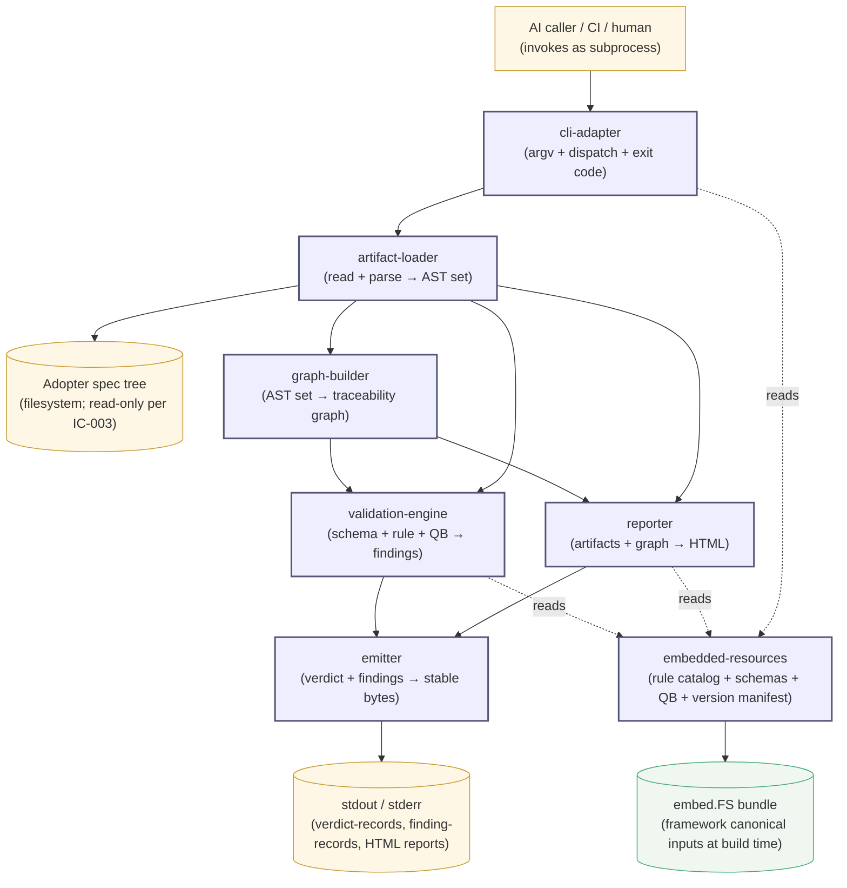
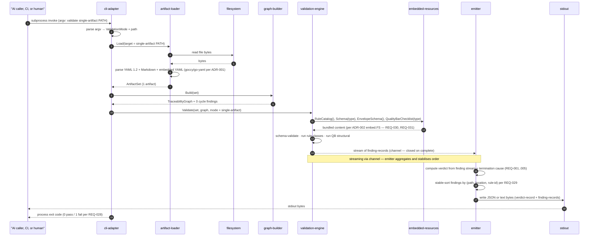
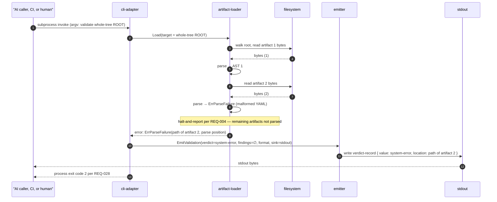
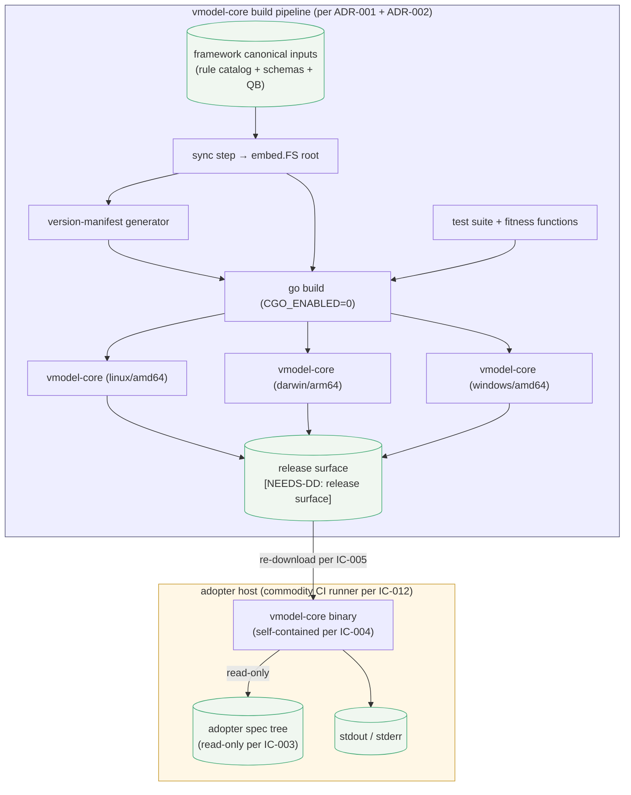

# Architecture — vmodel-core (root scope)

## Overview

This document specifies the root-scope architecture for **vmodel-core** — the deterministic CLI that validates VModelWorkflow spec artifacts and reports on spec-tree state. It refines `specs/requirements.md` (REQ-001..REQ-032) under the two foundational ADRs already accepted: ADR-001 (Go implementation) and ADR-002 (compile-time `embed.FS` bundling of the framework canonical rule catalog, schema set, and Quality Bar checklist set, with no runtime override). vmodel-core is, per the framework's three-product structure (`TARGET §10`), a child product of VModelWorkflow; this artifact is treated as effective root because no parent-scope (VModelWorkflow-level) Architecture exists yet (see `issues_found.md` Issue 2 — open framework gap).

The architecture-as-hypothesis bet for this scope: *we expect the embedded rule catalog, schema set, and Quality Bar checklist set to evolve at framework cadence — one update per framework release, propagated by re-download-and-replace per IC-005 — while the parser, graph-builder, validation-engine code, CLI surface, and emitter remain stable across multiple framework releases.* The bet motivates `embedded-resources` as a distinct child and the rebuild-per-framework-release operational stance of ADR-002. Future contributors have a place to record when the bet broke (e.g., a framework rule-catalog change that demands a parser-level structural change cascading into multiple components — at that point the bet, and possibly the decomposition, need revising).

The composition pattern is **pipeline within a hexagonal shell**. Hexagonal handles ports and adapters: `cli-adapter` is the driving port; `embedded-resources` (over compile-time `embed.FS`), the filesystem (inside `artifact-loader`), and stdout/stderr (inside `emitter`) are driven adapters. Pipeline orders the runtime flow inside the inner domain: `argv → load → graph → (validate | report) → emit → exit`. The split is load-bearing for two reasons: (a) the inner domain (parser, graph-builder, validation-engine, reporter) tests run against in-memory fakes for the embed.FS port and the filesystem port, supporting fast unit-test iteration in service of the AI-caller author retry loop's latency expectation in REQ-022; (b) the linear pipeline shape matches the per-run statelessness of IC-002 — no daemon, no shared state, every invocation reads inputs, computes, writes output, exits. Several template sections (middleware stack, message-bus topology, resilience patterns, multi-environment deployment, secrets flow, authn/authz at application layer) are stated `n/a` honestly with reasons rather than fabricated, because vmodel-core is a single-process CLI rather than a service.

## Structure Diagram



The internal region holds seven children (`cli-adapter`, `artifact-loader`, `graph-builder`, `validation-engine`, `reporter`, `emitter`, `embedded-resources`); the external actors are the invoking caller (AI agent, CI pipeline, or direct human), the adopter spec tree on the filesystem, and stdout/stderr. State lives in two places: the adopter spec tree (read-only per IC-003) and the compile-time `embed.FS` bundle (immutable post-build per ADR-002); no runtime state is carried between invocations (IC-002). The happy path flows top-to-bottom: caller → cli-adapter → artifact-loader (reading filesystem) → graph-builder → validation-engine or reporter → emitter → stdout. Dotted edges (`cli-adapter`, `validation-engine`, `reporter` → `embedded-resources`) are read-only accessor calls into the bundled framework canonical inputs.

## Decomposition

```yaml
decomposition:
  - id: cli-adapter
    purpose: "Translate argv and stdin into an internal command, dispatch it, and render the resulting verdict-record or report descriptor with the matching exit code."
    responsibilities:
      - "Parse argv and stdin into an internal command descriptor (validation mode + scope, or report type + parameters)."
      - "Dispatch the descriptor to validation-engine or reporter via in-process call; await completion."
      - "Map the resulting verdict-record or report descriptor to the OS process exit code per REQ-028 and surface output through emitter."
    allocates: [REQ-007, REQ-008, REQ-009, REQ-024, REQ-025, REQ-028, REQ-032]
    likely_change_driver: "CLI ergonomic shape evolves — subcommand structure / flag set firms up post-pilot per REQ-024 follow-up."
    bounded_context_line: "process-boundary translation vs validation/reporting domain (the inner domain has no opinions on argv shape; cli-adapter has no opinions on rule semantics)."
    owning_team_type: "stream-aligned"
    test_seam:
      driving_ports: ["OS process invocation (argv, stdin, exit)"]
      driven_ports: [IArtifactLoad, IValidate, IReport, IEmit, IFrameworkResources]
      fake_strategy: "in-process test harness wrapping main() with captured stdout/stderr/exit-code; inner-domain interfaces substituted by hand-written fakes."
    rationale: |
      cli-adapter is the only component touching argv, stdin, and process exit. As the
      hexagonal driving port, every input flows through it. The component is
      deliberately thin (argv parse, mode dispatch, exit-code render, version-query
      handling) because the requirements explicitly defer the CLI ergonomic shape to
      pilot evidence (REQ-024 follow-up); narrowing this child's responsibilities lets
      that shape evolve without rippling into the inner domain. Subcommand and flag
      structure are detailed-design scope: `[NEEDS-DD: cli-adapter — subcommand and
      flag structure]`.

  - id: artifact-loader
    purpose: "Resolve a path/scope/tree input into a parsed artifact AST set, reading from the adopter's filesystem with strict read-only discipline."
    responsibilities:
      - "Walk the input target (single file, scope-rooted subtree, or whole spec tree per REQ-007/008/009) and enumerate the artifact files in scope."
      - "Parse each file's Markdown body, YAML 1.2 front-matter, and embedded YAML blocks into a structured artifact AST; retain Mermaid blocks as raw source."
      - "Halt the run with a typed system-error condition on file IO failure or parse failure per REQ-004."
    allocates: [REQ-007, REQ-008, REQ-009, REQ-015, REQ-016, REQ-021]
    likely_change_driver: "framework conventions for embedded blocks (Mermaid placement, YAML block tags) evolve."
    bounded_context_line: "filesystem + Markdown/YAML parsing vs traceability/validation semantics (the loader has no opinions on what front-matter means; downstream components do)."
    owning_team_type: "stream-aligned"
    test_seam:
      driving_ports: [IArtifactLoad]
      driven_ports: ["filesystem (driven adapter)"]
      fake_strategy: "in-memory filesystem fixture (e.g., testing/fstest) for parser and walker tests; goccy/go-yaml is the only production parser used."
    rationale: |
      artifact-loader is the only component touching the adopter's filesystem (per
      IC-003 read-only) and the only consumer of the YAML 1.2 parser. Per ADR-001
      Propagation, YAML parsing uses goccy/go-yaml; that library choice is bound at
      this child. Splitting the loader from graph-builder is deliberate: file-IO and
      parse failures are local-per-artifact and report-and-halt (REQ-004) at this
      scope; the graph-builder operates over an already-parsed corpus and has no IO
      failure modes. The mode-aware traversal (single / subtree / whole) per
      REQ-007/008/009 lives here because it is a filesystem-walk concern, not a
      validation-rule concern.

  - id: graph-builder
    purpose: "Derive an in-memory traceability graph over a parsed artifact set, including cycle detection on the canonical link-type closure."
    responsibilities:
      - "Extract canonical traceability links (derived_from, allocates, verifies, governing_adrs, supersedes) from each parsed artifact's front-matter."
      - "Build an in-memory directed graph with artifacts as nodes and link types as edge labels."
      - "Detect cycles in derived_from and supersedes per REQ-012 and surface them as findings consumed by the validation-engine."
    allocates: [REQ-012, REQ-021]
    likely_change_driver: "framework adds a new canonical link type (currently nine per TARGET §7); graph schema evolves additively."
    bounded_context_line: "graph topology vs rule semantics (the graph holds structure; the rule engine interprets it)."
    owning_team_type: "stream-aligned"
    test_seam:
      driving_ports: [IGraphBuild]
      driven_ports: []
      fake_strategy: "in-memory artifact-set fixtures with hand-constructed link sets — no IO involved at this seam."
    rationale: |
      graph-builder is shared infrastructure between validation-engine (which
      consumes the graph for reference-integrity / completeness / cycle / cascade
      rules) and reporter (which consumes the graph for impact-analysis traversal —
      REQ-021). Splitting it out from validation-engine prevents reporter from
      re-implementing graph traversal, and lets cycle detection (REQ-012) live as a
      first-class graph property rather than buried inside the rule engine. The
      graph is rebuilt per invocation (no caching) per IC-002 stateless cold-start.

  - id: validation-engine
    purpose: "Run schema, traceability-rule, and Quality Bar structural validations against the parsed artifact set and the traceability graph, producing a stream of finding-records."
    responsibilities:
      - "Validate each artifact's front-matter against the framework canonical envelope schema and the per-artifact-type schema (REQ-015, REQ-016)."
      - "Enforce every rule in the framework canonical rule catalog by category (reference_integrity, completeness, cycle, retrofit, cascade) per REQ-010..REQ-014."
      - "Evaluate the structural-rigor items of each artifact's Quality Bar checklist per REQ-017; emit one finding-record per violation per REQ-006 with shape per REQ-026."
    allocates: [REQ-004, REQ-006, REQ-010, REQ-011, REQ-012, REQ-013, REQ-014, REQ-015, REQ-016, REQ-017, REQ-026]
    likely_change_driver: "framework adds new rules / schema / Quality Bar items at framework release cadence; consumed via embedded-resources without code change in many cases."
    bounded_context_line: "validation semantics vs structural plumbing (validation-engine owns interpretation of rules / schemas / QB; the loader and graph-builder own the data they consume)."
    owning_team_type: "stream-aligned"
    test_seam:
      driving_ports: [IValidate]
      driven_ports: [IArtifactLoad, IGraphBuild, IFrameworkResources]
      fake_strategy: "fake embedded-resources adapter loaded with hand-crafted rule/schema/QB fixtures; in-memory artifact + graph fixtures; one rule fixture per rule category to verify the orchestration-level dispatch."
    rationale: |
      The three rule types (schema, traceability rule, Quality Bar) share input
      shape (parsed artifacts + graph), output shape (finding-records per REQ-026),
      and orchestration (one pass per artifact / per scope / per tree per
      REQ-007..009). Folding them into one engine keeps the per-mode orchestration
      in one place at architecture level; the internal split into schema-validator,
      rule-evaluator, and QB-runner is detailed-design scope. JSON Schema draft
      2020-12 library choice is sub-architecture: `[NEEDS-DD: validation-engine —
      JSON Schema 2020-12 validator library selection]`. The component is the sole
      producer of finding-records (REQ-006); the emitter renders them but does not
      synthesise.

  - id: reporter
    purpose: "Produce one self-contained HTML report per requested report type (coverage / completeness / inventory / impact-analysis) over the parsed artifact set and traceability graph."
    responsibilities:
      - "Compute the report aggregate (proportion / count / inventory / impact closure) over artifacts and graph per REQ-018..REQ-021."
      - "Render the aggregate to a self-contained HTML document."
      - "Hand the rendered HTML to the emitter for output."
    allocates: [REQ-018, REQ-019, REQ-020, REQ-021]
    likely_change_driver: "report types added beyond the four at v1; HTML structure evolves; reporting output formats beyond HTML may be added per requirements.md *Open gaps*."
    bounded_context_line: "report aggregation + HTML rendering vs validation semantics (reporter aggregates; it does not enforce rules)."
    owning_team_type: "stream-aligned"
    test_seam:
      driving_ports: [IReport]
      driven_ports: [IArtifactLoad, IGraphBuild, IFrameworkResources]
      fake_strategy: "snapshot tests against rendered HTML for golden artifact + graph fixtures; html/template's safe-by-default escape is exercised by adversarial-content fixtures."
    rationale: |
      Reporter is read-only over the same data validation-engine consumes (artifacts
      + graph) but produces a different output shape (HTML document, not finding
      stream). Separating it lets the four report types (REQ-018..021) evolve
      without coupling to validation-rule changes. Per ADR-001 Propagation,
      html/template (stdlib) is the templating mechanism — context-aware escape gives
      safe-by-default output without a third-party dependency. Internal HTML
      template structure is detailed-design scope: `[NEEDS-DD: reporter — HTML
      report template structure]`.

  - id: emitter
    purpose: "Aggregate the finding stream from validation-engine, compute the verdict-record, and render the result to stdout in stable byte-order in the requested output format (JSON or text for validation; raw HTML for reports)."
    responsibilities:
      - "Collect the finding-record stream and compute the verdict-record value per REQ-001..REQ-005."
      - "Emit findings and verdict in stable byte-order (REQ-029) in JSON or text format per REQ-024."
      - "For reporting runs, pass the reporter's HTML document through to stdout unchanged."
    allocates: [REQ-001, REQ-002, REQ-003, REQ-005, REQ-024, REQ-027, REQ-029]
    likely_change_driver: "byte-stable ordering discipline tightens (e.g., new sortable field added to finding-record); output formats added beyond JSON / text."
    bounded_context_line: "emit + serialise vs aggregate + render (emitter renders to bytes; reporter aggregates into HTML; validation-engine produces findings)."
    owning_team_type: "stream-aligned"
    test_seam:
      driving_ports: [IEmit]
      driven_ports: ["stdout (driven adapter)"]
      fake_strategy: "byte-buffer sink; the load-bearing fitness test is 'same input twice → byte-identical output' (REQ-029) using a deterministic in-memory finding fixture."
    rationale: |
      REQ-029 (byte-identical output across runs against byte-identical input) is
      the load-bearing emitter constraint. Per ADR-001 Consequences, Go's map
      iteration is randomised by language design, so any traversal of map data must
      apply a stable ordering before emit. Centralising every emit boundary in this
      component makes the discipline auditable in one place rather than dispersed
      across producers; producers pass typed records to the emitter, and the emitter
      is the only path to stdout. The emitter is also the sole owner of
      verdict-record computation (REQ-001..005): the verdict is a pure function of
      the finding stream and the termination cause, kept here so the
      'exactly-one-verdict-per-run' invariant (REQ-001) is auditable in one place.

  - id: embedded-resources
    purpose: "Provide read-only access to the framework canonical rule catalog, schema set, and Quality Bar checklist set bundled into the binary at build time, plus the version manifest naming the bundled versions."
    responsibilities:
      - "Expose typed accessors for the rule catalog, the per-artifact-type schemas (envelope + six per-artifact), and the per-artifact-type Quality Bar checklists per REQ-030."
      - "Expose a version manifest (rule-catalog version, schema-set version, Quality Bar checklist set version) populated at build time per REQ-032."
      - "Refuse any access path outside the binary's compiled-in embed.FS per REQ-031 — no filesystem read outside the binary, no network access."
    allocates: [REQ-030, REQ-031, REQ-032]
    likely_change_driver: "framework releases bump bundled versions; vmodel-core's build pipeline syncs new versions in for the next vmodel-core release."
    bounded_context_line: "compile-time bundle vs runtime data (this component is the sole gatekeeper between embed.FS and the rest of the binary)."
    owning_team_type: "stream-aligned"
    test_seam:
      driving_ports: [IFrameworkResources]
      driven_ports: ["embed.FS (compile-time driven adapter)"]
      fake_strategy: "swap the embed.FS adapter for an in-memory fixture in tests; the production adapter reads from compile-time embed.FS only — no runtime override path exists."
    rationale: |
      ADR-002 makes this child a first-class boundary: the canonical inputs are
      bundled at compile time with no runtime override. Hiding embed.FS behind a
      typed accessor means consumers (validation-engine, reporter, cli-adapter) see
      a stable interface even if the bundling mechanism evolves (e.g., compression,
      lazy decode); it also localises the version-manifest source so REQ-032 has
      one truth. The architecture-as-hypothesis bet pivots on this child: framework
      cadence drives change here while the inner domain stays stable.
```

The one-sentence-responsibility test passes for every child (no hidden *and*s; each child's purpose is one clause). Every parent-allocated requirement (REQ-001..REQ-032) lands in at least one child's `allocates`. NFRs (REQ-022, REQ-023) are handled at composition level rather than per-child because they are end-to-end latency / scale properties that no single component owns; see *Quality attributes (allocated)* below.

The depth/cognitive-load/change-blast trio:
- **Depth test:** the seven children's interactions are explainable by the eight interfaces specified below; no inter-child interaction requires opening another scope to understand. Pass.
- **Cognitive-load test:** seven children fits one Requirements / Architecture pair a reviewer can hold in their head for a CLI tool of this scope. Pass.
- **Change-blast test fired during decomposition:** earlier drafts considered folding (a) `graph-builder` into `validation-engine` and (b) `embedded-resources` into a "shared kernel" available across components. Both folds were rejected. (a) `reporter` also depends on the graph (REQ-021 impact-analysis traversal), so folding the graph builder into validation-engine would force reporter to re-implement traversal. (b) ADR-002 makes the embed.FS boundary a first-class architectural concern; folding it into a shared kernel would lose the architecture-as-hypothesis bet's load-bearing boundary.

## Interfaces

```yaml
interfaces:

  # =========================================================================
  # External interfaces (process boundary)
  # =========================================================================

  - name: IValidationCLI
    from: "AI-caller / CI / direct-human-caller (external process)"
    to: cli-adapter
    protocol: "Process invocation over the operating-system standard process model (argv + stdin → stdout + stderr + exit code)."
    contract:
      operation: "vmodel-core <validation-subcommand> [flags] [path]  (subcommand and flag shape per [NEEDS-DD: cli-adapter — subcommand and flag structure])"
      preconditions:
        - "The supplied input identifies a readable artifact, scope path, or spec-tree root accessible to the invoking process (per REQ-024 precondition #1)."
        - "The vmodel-core binary is executable on the invoking host per IC-004 single-artefact distribution."
      postconditions:
        on_success:
          - "Exactly one verdict-record is emitted on stdout per REQ-001."
          - "Each rule violation detected during the run is reported as exactly one finding-record (REQ-006 with shape per REQ-026) on stdout, alongside the verdict-record."
          - "Process exit code is 0 (verdict=pass per REQ-002) or 1 (verdict=fail per REQ-003) per REQ-028."
          - "No artifact in the adopter's spec tree is created, modified, renamed, or deleted (IC-003)."
          - "Two invocations against byte-identical input emit byte-identical output (REQ-029)."
        on_precondition_failure:
          - "A diagnostic message is emitted on stderr identifying the failed precondition (e.g., unreadable input path, missing required argument)."
          - "Process exit code is 2 (system-error) per REQ-024 error_handling."
          - "No artifact in the adopter's spec tree is created, modified, renamed, or deleted (IC-003)."
        on_downstream_failure:
          - "n/a — vmodel-core has no remote downstream dependencies; no network access (REQ-031); framework canonical inputs are embed.FS-bundled per ADR-002."
      invariants:
        - "vmodel-core is read-only on the adopter's spec tree (IC-003)."
        - "Each invocation is independent with no shared mutable state between invocations (IC-002)."
        - "No filesystem read outside the binary's own path is performed for framework canonical inputs (REQ-031)."
        - "No network access at any point during the run (REQ-031)."
      errors:
        - { code: "system-error", exit_code: 2, meaning: "Non-recoverable system-level failure during the run; verdict-record value is 'system-error' per REQ-005." }
        # Note: 'pass' (exit 0) and 'fail' (exit 1) are verdict outcomes per REQ-027, not error conditions.
      quality_attributes:
        determinism: "byte-identical output across invocations against byte-identical input (REQ-029)."
        latency: "p95 wall-clock from process invocation to verdict-record emission, AI-caller author retry loop, on commodity CI runner (IC-012) — fail / goal / stretch / wish targets pending pilot calibration per REQ-022 follow-up; composition-level budget breakdown stated in *Quality attributes (allocated)* section."
        scale: "artifact count handled per whole-tree run within the latency budget — fail / goal / stretch / wish targets pending pilot calibration per REQ-023 follow-up."
        cold_start: "the only state — no warm-start, no daemon (IC-002)."
      authentication: "n/a at application layer — OS-level process invocation; identity is whatever OS user the process was launched as. No application-level authentication."
      authorisation: "n/a at application layer — OS file permissions govern read access to the adopter's spec tree and to the vmodel-core binary itself. No application-level authorisation."
      rationale: |
        The CLI subprocess shape is mandated by IC-006 (external callers integrate
        via CLI as stable contract) and rendered by REQ-024 + REQ-028 (verdict →
        exit-code mapping). Sync request-response shape is dictated by IC-002
        (cold-start is the only state) — no alternative protocol family is on the
        table for this interface. The byte-stable output invariant (REQ-029) is the
        load-bearing AI-caller-friendly property; without it, retry-loop diff
        comparisons become unreliable. authn/authz are stated as n/a at application
        layer to make the security model explicit: the binary trusts whoever
        invokes it and trusts the spec tree it reads (no privilege-elevation
        surface).
    version: "v1 — additive-only-within-major per REQ-024 versioning (new subcommands, new optional flags, new fields in JSON output, new exit-code values for new failure modes are permitted within v1)."
    deprecation_policy: "Pending — to be set by a product-scope ADR per REQ-024 follow-up: `[NEEDS-ADR: CLI deprecation notice period]`. Until that ADR is accepted, no v1 surface element may be deprecated."

  - name: IReportCLI
    from: "AI-caller / CI / direct-human-caller (external process)"
    to: cli-adapter
    protocol: "Process invocation over the operating-system standard process model (argv + stdin → stdout + stderr + exit code)."
    contract:
      operation: "vmodel-core <reporting-subcommand> [flags] [params]  (subcommand and flag shape per [NEEDS-DD: cli-adapter — subcommand and flag structure])"
      preconditions:
        - "The supplied parameters identify a v1 report type (coverage / completeness / inventory / impact-analysis per REQ-018..REQ-021) and a readable target scope on the filesystem accessible to the invoking process (per REQ-025 precondition)."
        - "The vmodel-core binary is executable on the invoking host per IC-004."
      postconditions:
        on_success:
          - "Exactly one self-contained HTML document is emitted on stdout (or to a caller-supplied output path per [NEEDS-DD: cli-adapter — output destination handling])."
          - "Process exit code is 0."
          - "No artifact in the adopter's spec tree is created, modified, renamed, or deleted (IC-003)."
          - "Two invocations against byte-identical input emit byte-identical output (REQ-029)."
        on_precondition_failure:
          - "A diagnostic message is emitted on stderr identifying the failed precondition."
          - "Process exit code is 2 per REQ-025 error_handling (mirrors the validation-side mapping per REQ-028; the two surfaces share one exit-code mapping per the single-binary single-product nature of vmodel-core)."
          - "No artifact in the adopter's spec tree is created, modified, renamed, or deleted (IC-003)."
        on_downstream_failure:
          - "n/a — no remote dependencies (REQ-031)."
      invariants:
        - "Read-only on the adopter's spec tree (IC-003)."
        - "Each invocation independent, no carried state (IC-002)."
        - "No filesystem read outside the binary for framework canonical inputs (REQ-031)."
        - "No network access at any point (REQ-031)."
      errors:
        - { code: "system-error", exit_code: 2, meaning: "Non-recoverable system-level failure during the report production." }
      quality_attributes:
        determinism: "byte-identical output across invocations against byte-identical input (REQ-029)."
        latency: "performance shape per REQ-022 applies to reporting on the same hardware profile (IC-012); specific targets pending pilot calibration."
        cold_start: "the only state (IC-002)."
      authentication: "n/a at application layer (same as IValidationCLI)."
      authorisation: "n/a at application layer (same as IValidationCLI)."
      rationale: |
        Reporting shares the CLI subprocess shape with validation per IC-006. The
        output format (HTML, REQ-025) differs from validation (JSON / text per
        REQ-024) because the consumer is a human reading for understanding (per
        needs.md turn 6). Whether reporting also produces JSON or text variants is
        deferred per requirements.md *Open gaps*; if added, it would extend this
        interface additively within v1. Sharing versioning with IValidationCLI per
        REQ-025 versioning treats the two surfaces as one stable contract on the
        single binary.
    version: "v1 — additive-only-within-major per REQ-025 versioning; same scheme and same pending deprecation policy as IValidationCLI."
    deprecation_policy: "Shared with IValidationCLI per REQ-025; pending `[NEEDS-ADR: CLI deprecation notice period]`."

  # =========================================================================
  # Internal interfaces (cross-child)
  # All internal interfaces are in-process Go calls and follow the same
  # versioning scheme: bundled into vmodel-core's overall MAJOR version per
  # ADR-001 / REQ-024; no separate semver per internal package boundary.
  # authn/authz on internal interfaces are n/a — in-process trust.
  # =========================================================================

  - name: IArtifactLoad
    from: cli-adapter
    to: artifact-loader
    protocol: "in-process Go call (driven port; depended-on interface)."
    contract:
      operation: "Load(target ArtifactTarget) (ArtifactSet, error)  -- where ArtifactTarget enumerates single-artifact / scope-rooted-subtree / whole-tree per REQ-007/008/009."
      preconditions:
        - "target is well-formed: a path to a file, a scope path, or a spec-tree root that is readable to the running process."
        - "filesystem (driven adapter) is reachable per IC-004 OS dependency only (no network)."
      postconditions:
        on_success:
          - "Returns an ArtifactSet containing one entry per artifact found in scope, each entry holding parsed front-matter, the Markdown body, embedded YAML blocks, and Mermaid blocks (raw)."
          - "ArtifactSet enumeration order is stable per (target, filesystem state) — supports REQ-029's emit-time stable-order keying."
        on_precondition_failure:
          - "Returns a typed error (ErrTargetUnreadable, ErrTargetNotFound) and an empty ArtifactSet."
          - "No partial state leaks back to the caller; the error is the sole signal."
        on_downstream_failure:
          - "Returns a typed error (ErrParseFailure, ErrIOFailure) on per-artifact failure during the walk; halts the walk per REQ-004."
          - "May return zero or more partially-loaded artifacts that completed before the halt; the caller treats this as the system-error track per REQ-004."
      invariants:
        - "Read-only on the filesystem (IC-003) — the loader never writes, renames, or deletes."
        - "No network access (REQ-031 invariant inherited at this call boundary)."
      errors:
        - { code: "ErrTargetUnreadable", meaning: "Supplied target path exists but is not readable by the process." }
        - { code: "ErrTargetNotFound",   meaning: "Supplied target path does not exist." }
        - { code: "ErrParseFailure",     meaning: "Encountered an artifact whose YAML/Markdown structure could not be parsed; halt-and-report per REQ-004." }
        - { code: "ErrIOFailure",        meaning: "Filesystem IO error during the walk; halt-and-report per REQ-004." }
      quality_attributes:
        determinism: "per-target enumeration order is stable; per-artifact parse output is a function of file bytes only — same bytes in, same AST out."
        latency: "single-artifact parse fits within the AI-caller author retry loop budget allocation (REQ-022); composition-level budget breakdown in *Quality attributes (allocated)* section."
      authentication: "n/a — in-process call."
      authorisation: "n/a — in-process call."
      rationale: |
        The contract is structured around the three validation modes of
        REQ-007/008/009 — a single ArtifactTarget type carries the enumeration
        intent, so artifact-loader does not need a per-mode entrypoint. Halt-and-
        report on per-artifact failure (REQ-004) is decided at this interface
        because file-IO and parse failures are the most common system-error sources;
        centralising them keeps the cli-adapter's error path simple.
    version: "internal Go package boundary — versioned with vmodel-core's overall MAJOR per ADR-001 / REQ-024; no separate semver."
    deprecation_policy: "Internal — changes follow vmodel-core's MAJOR-version compatibility regime."

  - name: IGraphBuild
    from: cli-adapter
    to: graph-builder
    protocol: "in-process Go call (driven port)."
    contract:
      operation: "Build(set ArtifactSet) (TraceabilityGraph, []Finding, error)  -- builds the graph and emits cycle findings inline per REQ-012."
      preconditions:
        - "ArtifactSet has been parsed by artifact-loader; every entry has well-formed front-matter."
      postconditions:
        on_success:
          - "Returns a TraceabilityGraph with artifacts as nodes and canonical link types as labelled directed edges (derived_from / allocates / verifies / governing_adrs / supersedes)."
          - "Returns zero or more cycle findings detected on derived_from and supersedes per REQ-012; finding-record shape per REQ-026."
          - "Graph node and edge enumeration order is stable per ArtifactSet — supports REQ-029."
        on_precondition_failure:
          - "Returns a typed error (ErrMalformedFrontMatter) and a partial graph; cli-adapter treats this as a system-error path per REQ-004."
        on_downstream_failure:
          - "n/a — pure in-memory computation; no downstream dependencies."
      invariants:
        - "Graph is computed fresh per invocation; no caching across calls (IC-002 stateless cold-start)."
      errors:
        - { code: "ErrMalformedFrontMatter", meaning: "An artifact's front-matter is structurally malformed beyond what the loader caught; halt." }
      quality_attributes:
        determinism: "graph topology and cycle-finding emission are pure functions of ArtifactSet content."
        latency: "graph build is O(N) over artifacts + edges; budgeted under whole-tree run latency (REQ-022/023)."
      authentication: "n/a — in-process call."
      authorisation: "n/a — in-process call."
      rationale: |
        Returning cycle findings inline (rather than via a separate call) keeps
        cycle detection a first-class graph property, matching REQ-012's
        category-level binding. The graph is rebuilt per run because (a) it is
        cheap (in-memory, sub-second at expected scale per REQ-023) and (b) caching
        would conflict with IC-002 stateless cold-start.
    version: "internal — same scheme as IArtifactLoad."
    deprecation_policy: "Internal — same scheme as IArtifactLoad."

  - name: IValidate
    from: cli-adapter
    to: validation-engine
    protocol: "in-process Go call."
    contract:
      operation: "Validate(set ArtifactSet, graph TraceabilityGraph, mode ValidationMode) (<-chan Finding, error)  -- streaming finding channel; closed on complete or on halt."
      preconditions:
        - "ArtifactSet and TraceabilityGraph are well-formed (built by artifact-loader and graph-builder)."
        - "embedded-resources is reachable (compile-time bundle is intact per REQ-031)."
      postconditions:
        on_success:
          - "Emits zero or more finding-records on the returned channel, one per rule violation per REQ-006."
          - "Each finding-record carries the five-field shape per REQ-026 (Locate, Identify, Triage, Summarise, Related-artifacts)."
          - "All five rule classes are evaluated per REQ-010..REQ-014; envelope and per-type schema per REQ-015/016; Quality Bar structural items per REQ-017."
          - "The channel is closed when evaluation completes."
        on_precondition_failure:
          - "Closes the channel without emission and returns a typed error to the caller (ErrPreconditionFailed)."
        on_downstream_failure:
          - "Closes the channel after emitting any pre-halt findings and returns a typed error (ErrSystemError); signals the system-error track per REQ-004."
      invariants:
        - "Findings emitted in source-document iteration order on the channel; AI callers may not assume any other ordering at this interface (the emitter applies the byte-stable order downstream per REQ-029)."
        - "Findings produced are a function of (ArtifactSet, TraceabilityGraph, embedded-resources content) only — no external influence (REQ-031)."
      errors:
        - { code: "ErrPreconditionFailed", meaning: "Inputs malformed before validation could begin." }
        - { code: "ErrSystemError",        meaning: "Non-recoverable per REQ-004 (e.g., corrupted embedded-resources content, internal panic recovered into typed error); halt." }
      quality_attributes:
        determinism: "given identical inputs (artifacts, graph, embedded-resources versions), the multiset of findings is identical run-to-run; ordering is stabilised at emit time."
        latency: "validation cost dominates the AI-caller author retry loop on commodity CI runner per REQ-022; composition-level budget breakdown in *Quality attributes (allocated)* section."
      authentication: "n/a — in-process call."
      authorisation: "n/a — in-process call."
      rationale: |
        Streaming via a channel matches Go idiom and lets the emitter stabilise
        ordering at its boundary, rather than forcing the engine to materialise the
        full finding set first; this is consistent with REQ-029's
        stability-at-emit-boundary read of ADR-001's map-iteration consequence. The
        five rule classes (REQ-010..014), schema (REQ-015/016), and QB structural
        (REQ-017) are bundled into one Validate call because their orchestration is
        a single per-artifact / per-scope / per-tree pass; splitting them at this
        interface would force the cli-adapter to know orchestration order. Internal
        split into schema-validator / rule-evaluator / QB-runner is detailed-design
        scope.
    version: "internal — same scheme as IArtifactLoad."
    deprecation_policy: "Internal — same scheme as IArtifactLoad."

  - name: IReport
    from: cli-adapter
    to: reporter
    protocol: "in-process Go call."
    contract:
      operation: "Report(set ArtifactSet, graph TraceabilityGraph, request ReportRequest) (HTMLDocument, error)"
      preconditions:
        - "ArtifactSet and TraceabilityGraph are well-formed."
        - "request identifies a v1 report type (coverage / completeness / inventory / impact-analysis per REQ-018..REQ-021) with parameters appropriate to the type."
        - "embedded-resources is reachable (the criterion catalog is needed for completeness reports per REQ-019)."
      postconditions:
        on_success:
          - "Returns one self-contained HTML document carrying the requested report content per REQ-018..REQ-021."
          - "HTML rendering is byte-identical for byte-identical inputs (REQ-029)."
        on_precondition_failure:
          - "Returns a typed error (ErrUnknownReportType, ErrInvalidParameters) without emitting an HTML document."
        on_downstream_failure:
          - "n/a — no remote dependencies."
      invariants:
        - "Read-only over ArtifactSet and TraceabilityGraph (no mutation)."
        - "HTML is self-contained per REQ-025 (no external asset references in v1)."
      errors:
        - { code: "ErrUnknownReportType", meaning: "Requested report type is not in the v1 set." }
        - { code: "ErrInvalidParameters", meaning: "Parameters do not satisfy the report type's contract." }
      quality_attributes:
        determinism: "byte-identical HTML for byte-identical inputs (REQ-029)."
        latency: "report computation is dominated by graph traversal cost for impact-analysis (REQ-021); shape per REQ-022 / REQ-023."
      authentication: "n/a — in-process call."
      authorisation: "n/a — in-process call."
      rationale: |
        One Report entrypoint covers all four v1 report types per REQ-018..021; a
        per-type entrypoint would split orchestration without architectural benefit.
        Self-contained HTML (REQ-025) is the v1 commitment; if JSON or text variants
        are added per requirements.md *Open gaps*, they would either extend this
        interface (return-type discriminator) or split into a sibling interface
        (IReportJSON). Defer to that point.
    version: "internal — same scheme."
    deprecation_policy: "Internal — same scheme."

  - name: IEmit
    from: "validation-engine, reporter"
    to: emitter
    protocol: "in-process Go call."
    contract:
      operation: |
        EmitValidation(verdict Verdict, findings <-chan Finding, format OutputFormat, sink io.Writer) error
        EmitReport(doc HTMLDocument, sink io.Writer) error
      preconditions:
        - "For EmitValidation: the findings channel will be closed by the producer when done; verdict is one of {pass, fail, system-error} per REQ-027."
        - "For EmitReport: doc is the HTML document produced by reporter."
        - "sink is a writable byte sink (typically stdout)."
      postconditions:
        on_success:
          - "All emitted bytes are determined solely by (input arguments, output format); two calls with byte-identical arguments produce byte-identical output (REQ-029)."
          - "For EmitValidation: emitted bytes contain exactly one verdict-record per REQ-001 plus zero-or-more finding-records per REQ-026, in the requested format (JSON or text per REQ-024)."
          - "For EmitReport: emitted bytes are the HTML document unchanged."
          - "Findings are emitted in stable order keyed by (artifact path, location-within-artifact, rule identifier) per REQ-029 acceptance and ADR-001 Negative #3."
        on_precondition_failure:
          - "Returns a typed error before writing any bytes (ErrInvalidVerdict, ErrUnsupportedFormat)."
        on_downstream_failure:
          - "Returns a typed error if the sink fails during write (ErrSinkWrite); the run becomes system-error path per REQ-004."
      invariants:
        - "Sole producer of bytes on the validation track — every finding-record and verdict-record passes through this component."
        - "No collection traversal that depends on Go map iteration order leaks into emit output (REQ-029 / ADR-001 mitigation)."
      errors:
        - { code: "ErrInvalidVerdict",    meaning: "Verdict value not in {pass, fail, system-error}." }
        - { code: "ErrUnsupportedFormat", meaning: "OutputFormat not in {JSON, text} for EmitValidation, or not HTML for EmitReport." }
        - { code: "ErrSinkWrite",         meaning: "Underlying sink (stdout) returned a write error; system-error path." }
      quality_attributes:
        determinism: "byte-identical output for byte-identical input (REQ-029) — load-bearing contract of this component."
        latency: "emit cost is O(findings + verdict bytes); minor relative to validation cost on the latency budget."
      authentication: "n/a — in-process call."
      authorisation: "n/a — in-process call."
      rationale: |
        Centralising stable-order emit at one interface is the realisation of
        REQ-029 + ADR-001's Go-map-iteration consequence: producers can use
        idiomatic Go internally, and the byte-stability discipline lives at the
        emit boundary rather than dispersed across producers. Two operations
        (EmitValidation, EmitReport) cover the two output tracks (validation
        findings + verdict; reporting HTML) without extra entrypoints. The internal
        stable-ordering key (artifact path + location + rule identifier) is decided
        at architecture level because it is observable in REQ-029's acceptance test
        (re-run-and-diff) and downstream consumers may write tests against it.
    version: "internal — same scheme."
    deprecation_policy: "Internal — same scheme."

  - name: IFrameworkResources
    from: "validation-engine, reporter, cli-adapter"
    to: embedded-resources
    protocol: "in-process Go call."
    contract:
      operation: |
        RuleCatalog() RuleCatalog
        Schema(artifactType ArtifactType) (Schema, error)
        EnvelopeSchema() Schema
        QualityBarChecklist(artifactType ArtifactType) (QBChecklist, error)
        Versions() VersionManifest
      preconditions:
        - "artifactType (where applicable) is one of the six framework-canonical types (product-brief, requirements, architecture, adr, detailed-design, test-spec)."
      postconditions:
        on_success:
          - "Returns the typed accessor's bound content as compiled into the binary at build time (REQ-030)."
          - "Versions() returns a VersionManifest naming the rule-catalog version, schema-set version, and Quality Bar checklist set version compiled into the binary at build time (REQ-032)."
          - "Multiple calls return content that is byte-identical to itself across the lifetime of the binary (the bundle is immutable post-build)."
        on_precondition_failure:
          - "Returns a typed error (ErrUnknownArtifactType) for Schema / QualityBarChecklist when artifactType is unknown."
        on_downstream_failure:
          - "n/a — the bundle is in-binary; absence of bundled content is a build-time failure, not a runtime one."
      invariants:
        - "No filesystem read outside the binary's compiled-in embed.FS (REQ-031)."
        - "No network access (REQ-031)."
        - "Returned content is read-only; mutating it is undefined behaviour at the Go-package boundary."
      errors:
        - { code: "ErrUnknownArtifactType", meaning: "artifactType is not one of the six framework-canonical types." }
      quality_attributes:
        determinism: "content is bound at build time; runtime accessor is a pure function over (binary bytes)."
        latency: "decode cost is sub-millisecond at expected scale (sub-megabyte JSON inputs per ADR-002 Assumption #5)."
      authentication: "n/a — in-process call."
      authorisation: "n/a — in-process call."
      rationale: |
        Five typed accessors cover every consumer's need without exposing the
        embed.FS internals; this lets the bundling mechanism evolve (e.g.,
        compression, lazy decode) without changing the consumer API. ISP discipline
        is satisfied at consumer-side: each consumer (cli-adapter for Versions
        only, validation-engine for all four content accessors, reporter for
        RuleCatalog + QualityBarChecklist + Schema) declares only the subset it
        uses on its own consumer-side interface (Go's accept-side interface idiom).
        Versions() is the single source of truth for REQ-032 — cli-adapter's
        version-query subcommand reads from it. Per ADR-002, no runtime override
        path exists at this interface; that is structural enforcement of IC-007 +
        IC-002 at the architecture boundary.
    version: "internal — same scheme."
    deprecation_policy: "Internal — same scheme."
```

Eight interfaces total: two external (process boundary) and six internal (cross-child). Every interface entry carries the full Design-by-Contract clause set (preconditions, postconditions on success / precondition-failure / downstream-failure, invariants, typed error enum, quality attributes, authentication, authorisation, rationale). No fat god-interfaces: each interface is segregated by responsibility, with consumer-side narrowing applied via Go's accept-side interface idiom.

## Composition

### Runtime pattern

**Pipeline within a hexagonal shell.** Hexagonal handles ports and adapters: `cli-adapter` is the driving port; `embedded-resources` (over compile-time `embed.FS`), the filesystem (inside `artifact-loader`), and stdout/stderr (inside `emitter`) are driven adapters. Pipeline orders the runtime flow inside the inner domain: `argv → load → graph → (validate | report) → emit → exit`.

The pattern is committed inline at this artifact rather than extracted to an ADR because it satisfies neither *cross-cutting* (only this scope uses it; vmodel-core is the only product authored here) nor *hard-to-reverse* (refactoring to pure pipeline or pure layered would be a manageable code move at vmodel-core's expected size). The two halves of the rationale:

- **Hexagonal half:** embed.FS access (per ADR-002) and filesystem access (per IC-003 read-only adopter spec tree) are both substitutable at unit-test scope; stating them as driven ports lets every inner-domain test run against in-memory fakes. Fast unit tests are the load-bearing testability commitment in service of the AI-caller author retry loop's iteration speed (REQ-022 indirectly — most retries terminate locally on the AI's own output before vmodel-core latency dominates).
- **Pipeline half:** the runtime flow is genuinely linear — there is no fan-out, no parallelism, no choreography — and stating it as a pipeline matches IC-002 stateless cold-start without overstating architectural complexity.

The combination is what `references/composition-patterns.md` calls "request-response with internal pipeline orchestration"; here, the request is a single CLI subprocess invocation (synchronous; the user is waiting); the response is the verdict-record + finding-records (validation track) or HTML document (reporting track) on stdout.

### Wiring

- **DI strategy.** Constructor injection at a single composition root in `cmd/vmodel-core/main.go`. The root constructs the embedded-resources adapter (the only `embed.FS`-backed implementation), the filesystem adapter (stdlib `os.ReadFile` / `filepath.Walk` plus `goccy/go-yaml` per ADR-001), and the stdout adapter; passes them into the inner-domain components by interface type. No service locator. No field injection. No DI container. Adapters are substitutable per the test-seam shape declared on each child.

- **Middleware stack.** **n/a — single-process CLI; no per-request middleware.** vmodel-core does not run an HTTP server, gRPC server, or message consumer; the closest analog (cli-adapter's argv-parse → mode-dispatch → emit-rendering chain) is a single linear path stated in the IValidationCLI / IReportCLI contracts above and the sequence diagrams below. This is a deliberate honest departure from the template's service-shaped slot rather than a fabrication.

- **Message-bus topology.** **n/a — no async messaging at this scope.** vmodel-core has no event bus, no queue, no pub/sub. The only async edge in the system is "the OS process exits" (which is not a message); every cross-component edge inside the binary is a synchronous Go function call.

### Sequence diagrams

#### Happy path: single-artifact validation (AI-caller author retry loop, the most latency-sensitive workflow per REQ-022)



Five observations make this Composition load-bearing. (1) Every cross-component edge is synchronous, in-process; there is no fan-out, no fork-join, no concurrency primitive at the architecture level. (2) `embedded-resources` is consulted only by `validation-engine` (and by `cli-adapter` for the version query in the REQ-032 path) — a clean boundary that keeps the inner domain ignorant of the embed.FS internals. (3) The `emitter` is the sole producer of bytes on stdout; the stable-order guarantee of REQ-029 lives at exactly one place. (4) The verdict is computed at the `emitter` (as a function of the finding stream + termination cause), not at the `validation-engine` — keeping verdict computation co-located with the emit point makes the invariant "exactly one verdict-record per run" (REQ-001) auditable in one component. (5) The `embedded-resources` fetch happens only after parsing has succeeded — so REQ-031's no-external-access invariant is always upheld regardless of failure mode.

#### Critical failure path: unparseable artifact during whole-tree validation (system-error halt per REQ-004)



Three observations. (1) Halt-and-report (REQ-004) is realised as the first `ErrParseFailure` terminating the load walk; no subsequent artifacts are parsed and no findings are emitted. (2) The verdict-record value is `system-error` per REQ-005 and the exit code is 2 per REQ-028 — the AI caller's branching logic distinguishes "this tree has findings" (exit 1) from "this tree could not be evaluated" (exit 2) on exit code alone, per the needs.md (turn 11) commitment that system-error and findings live on different tracks. (3) The emitter still produces exactly one verdict-record (REQ-001 cardinality holds for halted runs) — that property is what REQ-001's *terminates* trigger phrasing covers in combination with REQ-005.

### Deployment intent (root scope only)

**Honest departure from the template.** vmodel-core is a single-process CLI distributed as a binary, not a service deployed to an orchestrator. The deployment-intent slots are populated below with reality, not service-shaped fabrication.

- **Environments.** One — the adopter's host (a developer workstation, a commodity CI runner per IC-012, or an AI-agent container). vmodel-core does not have its own dev / staging / production split because there is no hosted instance of vmodel-core; every adopter runs the binary they downloaded. Differences across adopter hosts are bound by IC-012 (target hardware = commodity CI runner) and by IC-004 (Linux, macOS, Windows on x86-64 and arm64).
- **Orchestration target.** **n/a — no orchestrator.** Distribution is "the adopter downloads the binary and runs it" per IC-004 + IC-005. There is no Kubernetes, no FaaS, no VM image, no service mesh. The OS process model (argv + stdin + stdout + stderr + exit code) is the entire runtime contract.
- **Runtime units.** **One — the vmodel-core binary itself.** Per IC-002, each invocation is independent; every invocation is the entire runtime unit; the unit's lifecycle is the OS process lifecycle (start → run → exit). No deploy/scale/failure split because there is nothing to split.
- **Build pipeline (the load-bearing deployment concern at this scope).** vmodel-core's build pipeline *is* the deployment intent for this artifact, because per ADR-002 it is the only point at which the framework canonical inputs are bundled into the binary. The pipeline:
  1. **Sync** framework-side JSON inputs (rule catalog, schema set, Quality Bar checklists) into the embed.FS root; the version manifest is generated from the synced source versions per REQ-032.
  2. **Test** — run the Go test suite, including the fitness-function tests stated under *Evolution + fitness functions*.
  3. **Cross-compile** via `CGO_ENABLED=0 go build` with `GOOS={linux,darwin,windows}` and `GOARCH={amd64,arm64}` per ADR-001 Consequences — produces statically-linkable single-file binaries satisfying IC-004.
  4. **Publish** to a release surface — `[NEEDS-DD: build-pipeline release surface]` (candidate surfaces: GitHub Releases, brew, scoop; binary signing and integrity attestation also `[NEEDS-DD: build-pipeline release surface — binary signing]`).
  5. **Adopters consume** via re-download-and-replace per IC-005; no auto-update, no package-manager integration, no version-skew management at runtime.

  This pipeline is referenced via `governing_adrs: [ADR-001, ADR-002]` only conceptually. At v1, it lives as shell scripts plus the Go toolchain rather than separate IaC. If it grows into provisioned infrastructure (a hosted CI service, a release-automation cluster), the IaC paths land here.

- **Cost model.** **n/a — no infra footprint.** vmodel-core has no hosted instance and therefore no monthly-spend envelope, no cost-per-request target, and no cost-of-a-9. Adopters bear their own cost (CI minutes for whole-tree runs; local CPU for single-artifact runs); IC-012 (commodity CI runner) bounds the per-run resource shape but is a requirements-side concern, not an architecture-side cost commitment.

- **IaC artifacts.** **n/a at v1.** No infrastructure is provisioned; the build pipeline is shell + Go toolchain. Revisit if a hosted CI service or a release-automation infrastructure is added later.

- **12-factor stance.** Several factors apply trivially because vmodel-core is a CLI rather than a server: *processes disposable* (every invocation is disposable per IC-002); *dev/prod parity* (every adopter runs the same binary; no environment-specific build); *logs as streams* (stderr is the log stream; see *Observability + security* below). *Config* is via argv + flags (environment-variable-driven config is deliberately absent at v1 to foreclose IC-007 relaxation surface). *Backing services* and *port binding* are n/a (no service to bind, no backing service).



The diagram is the build-time view rather than a runtime topology view because for vmodel-core the load-bearing deployment-intent concern is the build pipeline (per ADR-002 schema-binding), not a runtime topology (there is none). The adopter host is shown for completeness — to make explicit that the binary is self-contained (IC-004), reads adopter spec tree read-only (IC-003), and writes only to stdout/stderr (no file-system mutation per IC-003).

## Quality attributes (allocated)

| Parent NFR / IC | Lands at |
|---|---|
| **REQ-022** — p95 wall-clock from invoke to verdict, AI-caller author retry loop, commodity CI runner; targets pending pilot calibration | Composition-level cross-cutting commitment; allocated as a p95 budget across components: cli-adapter (argv parse + dispatch overhead) + artifact-loader (file IO + parse) + graph-builder (graph compute) + embedded-resources (decode at first access) + validation-engine (rule + schema + QB evaluation) + emitter (stable-sort + serialise + write). Per-component split pending pilot calibration; the requirement's own follow-up (REQ-022 owner: stakeholder / framework author) carries the action. |
| **REQ-023** — artifact-count handled per whole-tree run within REQ-022 latency budget; targets pending pilot calibration | Composition-level cross-cutting; landed in graph-builder (O(N) graph build) + validation-engine (O(N × R) where R is rule count per artifact-type) + reporter (impact-analysis traversal, O(graph depth × edges)). Per-component scaling shape captured in `[NEEDS-DD: validation-engine — per-rule-class scaling characteristics]`. |
| **IC-012** — worst-case target hardware = commodity CI runner | Bounds REQ-022 / REQ-023; treated as the test-environment of the per-component p95 budget tests under *Evolution + fitness functions*. |
| **IC-001** — no LLM in runtime path | Composition-level invariant; structurally enforced (no LLM-SDK in dependency graph) via the *static-import-scan* fitness function below. |
| **IC-002** — stateless cold-start | Composition-level invariant; realised by the pipeline-within-hexagonal pattern (no daemon, no shared state, no caching across invocations); enforced by IFrameworkResources / IArtifactLoad / IGraphBuild contract invariants. |
| **IC-003** — read-only on adopter spec tree | Composition-level invariant; realised by artifact-loader's contract on IArtifactLoad and stated as an invariant on IValidationCLI / IReportCLI. |
| **IC-004** — single-artefact distribution | Realised by ADR-001 Consequences (`CGO_ENABLED=0 go build` cross-compile) at the build pipeline; binary self-contained at runtime. |
| **IC-005** — re-download-and-replace update | Realised by the build pipeline shape — every release is a complete new binary; no in-place auto-updater, no package-manager dependency. |
| **IC-006** — CLI as stable contract | Realised by IValidationCLI + IReportCLI; versioning regime per REQ-024 (additive-only-within-major). |
| **IC-007** — no relaxation modes | Realised by ADR-002 (no runtime override of canonical inputs); structurally enforced at IFrameworkResources (no override entrypoint exists in the interface). |
| **IC-008** — open-source distribution | Architecture-neutral; satisfied at the release-surface step (license decision pending per requirements.md *Open gaps*). |
| **REQ-029** — byte-identical output | Realised by emitter as the sole producer of bytes; load-bearing invariant on IEmit; enforced by the *re-run-and-diff* fitness function below. |
| **REQ-030 / REQ-031 / REQ-032** — schema embedding, no external access, version queryability | Realised by embedded-resources child + IFrameworkResources interface + cli-adapter's version-query subcommand path. |

## Resilience

Honest departure: vmodel-core has **almost no resilience surface** because it has no remote dependencies, no shared resources to partition, and no async edges. Each pattern's applicability is stated explicitly:

- **Bulkheads.** **n/a** — no shared connection pools, thread pools, or external-dependency pools. The binary is single-process; the only "shared resource" is process memory, which is not partitioned at this layer.
- **Circuit breakers.** **n/a** — no cross-service boundaries. Failures of the adopter filesystem or a malformed artifact are non-recoverable per REQ-004 and propagate to system-error directly; circuit breaking would offer no benefit.
- **Retry policy.** **n/a** — no retried operations. File-IO and parse failures halt the run per REQ-004; the AI caller's retry policy (re-invoke vmodel-core, possibly after the AI agent regenerates the artifact) lives outside this scope.
- **Graceful degradation vs fallback.** The partial-failure behaviour committed in needs.md (turn 11) is **halt-and-report**, not graceful degradation. When a system-level failure is encountered during a multi-artifact operation, the run halts; remaining artifacts are not evaluated. This is by deliberate stakeholder commitment per REQ-004 rationale — system-error and findings live on different tracks; the AI caller does not have to disambiguate "this artifact has findings" from "this artifact couldn't be evaluated". The non-essential-vs-essential split is therefore moot at this scope.
- **Failure domains.** One — the OS process running the vmodel-core binary. If the process crashes, the run fails atomically and the adopter re-runs. No multi-host, no multi-region, no AZ-level redundancy at vmodel-core scope.
- **Common-cause failure / redundancy independence.** **n/a** — no redundancy mechanism is in play. Two adopter hosts running vmodel-core are not redundant in the architectural sense; they are independent users.

## Observability + security

Honest departure: vmodel-core is a single-shot CLI with minimal observability and security surface.

- **Telemetry.** Stderr structured logs at INFO / WARN / ERROR levels, controlled by `--verbose` / `--quiet` flags (these flags are deferred to DD per `[NEEDS-DD: cli-adapter — subcommand and flag structure]` since requirements.md *Open gaps* defers the precise CLI ergonomic shape). No metrics, no traces — single-shot CLI means no in-process metrics emission and no distributed-trace context to propagate. No external telemetry destination at v1. Common context fields on stderr log records: `run_id` (UUID generated per invocation, used by AI callers for correlation), `mode` (single-artifact / subtree / whole-tree / report-type), `binary_version`. Sampling: 100% (every emitted line is written; the adopter chooses verbosity).

- **Trust zones.** Two — *outside-the-binary* (the OS, the adopter spec tree, argv, environment) and *inside-the-binary* (the inner domain plus embed.FS). The zone boundary is the OS process boundary. vmodel-core trusts everything inside its own process and trusts whatever invokes it; it does not assert identity, does not validate identity, and does not authorise.

- **STRIDE per zone crossing (outside → inside).**
  - *Spoofing:* n/a — no identity asserted; the binary trusts its invoker.
  - *Tampering:* the embed.FS bundle is bound at compile time; runtime tampering requires modifying the binary itself, addressed via `[NEEDS-DD: build-pipeline release surface — binary signing]`. The adopter spec tree is read-only per IC-003; vmodel-core does not modify it.
  - *Repudiation:* n/a — no audit log emitted; the run output (stdout) is the only artifact, and the adopter is responsible for capturing it if audit is required.
  - *Information disclosure:* vmodel-core emits content from the adopter's spec tree on stdout (verdict, findings, reports). This is the explicit purpose of the tool; the adopter is responsible for not running vmodel-core on data they do not want emitted.
  - *Denial of service:* the only DoS surface is "the adopter feeds vmodel-core a maliciously large or pathological spec tree". Bounded by IC-012 hardware budget; if it OOMs or runs past a sensible time bound, that surfaces as a system-error per REQ-004.
  - *Elevation of privilege:* n/a — no privilege-bearing operations.

- **Authn / authz at every externally callable interface.** n/a at application layer — file-permission-based via the OS for both IValidationCLI and IReportCLI. Stated explicitly in their contracts.

- **Secrets flow.** **n/a** — vmodel-core handles no secrets. No API keys, no DB credentials, no signing keys at runtime. The build-pipeline-side release-signing key (when added per `[NEEDS-DD: build-pipeline release surface — binary signing]`) lives in the build environment, not in the runtime binary.

## Evolution + fitness functions

Architecture-as-hypothesis bet (restated from Overview): *we expect the embedded rule catalog, schema set, and Quality Bar checklist set to evolve at framework cadence — one update per framework release — while the parser, graph-builder, validation-engine code, CLI surface, and emitter remain stable across multiple framework releases.*

```yaml
fitness_functions:
  - property: "Determinism — byte-identical output for byte-identical input (REQ-029)."
    classification: "atomic + triggered (CI gate)"
    check: "run vmodel-core on a fixture spec tree twice; diff stdout byte-for-byte; fail on any difference. Covers both validation track (JSON, text) and reporting track (HTML)."

  - property: "No external schema or network access at runtime (REQ-031)."
    classification: "atomic + triggered (CI gate)"
    check: "run vmodel-core in a sandbox with no network egress and a filesystem mount restricted to the binary's own path plus a sandbox-resolvable adopter spec tree; assert validation and reporting complete successfully on a sandbox-internal input."

  - property: "No LLM SDK imports anywhere in the binary (IC-001)."
    classification: "atomic + triggered (CI gate)"
    check: "static-import scan over the build target's full dependency graph; fail if any of {anthropic, openai, cohere, google generative AI, hugging-face client, ...} package is reachable from the cmd/vmodel-core entrypoint."

  - property: "AI-caller author retry loop p95 latency within budget (REQ-022)."
    classification: "atomic + continuous (CI benchmark; promote to gate once REQ-022 targets are calibrated)."
    check: "synthetic single-artifact-validate workload on commodity CI runner; track p95 across N runs; alert / fail on rolling regression. Specific threshold pending pilot calibration per REQ-022 follow-up."

  - property: "Per-child Go-package coupling and LOC bounds — preserves the architecture-as-hypothesis bet (parser / graph-builder / validation-engine / CLI surface / emitter remain stable across framework releases)."
    classification: "atomic + triggered (CI gate)"
    check: "static analysis on each child's Go package — fail if a child's import set crosses a sibling-internal package (only public interface types may cross), or if any child exceeds its LOC threshold. Specific thresholds set during DD per `[NEEDS-DD: per-child LOC and coupling thresholds]`."

  - property: "Bundled-version queryability (REQ-032) — version manifest content matches the source versions synced at build time."
    classification: "atomic + triggered (CI gate)"
    check: "build pipeline test — after the sync step, the generated VersionManifest's three version identifiers match the source-version metadata of the synced framework files."
```

The six fitness functions cover the four standard categories from `references/evolution-and-fitness-functions.md` (dependency direction, latency budget, module size + coupling, security posture / IC-001 enforcement) plus two vmodel-core-specific load-bearing properties (determinism per REQ-029, version-manifest correctness per REQ-032).

No strangler-fig migration in play (greenfield).

## Open follow-ups

These are the explicit deferrals carried by this artifact. Each item names what is deferred, the owner, the action that resolves it, and where in this artifact the deferral is referenced. Resolution does not change this artifact's load-bearing shape; the items below are downstream commitments tracked here for indexability.

### Pending Detailed Designs

- **`cli-adapter` — subcommand and flag structure.**
  - *Owner*: vmodel-core implementor (framework author in dogfooding role).
  - *Action*: in the cli-adapter DD, specify the subcommand verb structure, flag set, stdin acceptance, `--help` shape, `--verbose` / `--quiet` semantics, and version-query subcommand. Bound upstream by REQ-024 follow-up (CLI ergonomic shape from pilot evidence + the codex `pat-cli-design-for-ai-agents` pattern page).
  - *Cited at*: cli-adapter rationale; IValidationCLI operation; IReportCLI operation; Observability + security.

- **`cli-adapter` — output destination handling.**
  - *Owner*: vmodel-core implementor.
  - *Action*: in the cli-adapter DD, specify whether reporting output goes to stdout vs caller-supplied path; stdin acceptance; error-stream routing.
  - *Cited at*: IReportCLI postcondition.

- **`validation-engine` — JSON Schema 2020-12 validator library selection.**
  - *Owner*: vmodel-core implementor.
  - *Action*: select a Go library implementing JSON Schema draft 2020-12 and document the selection in the DD; if the choice turns out to be load-bearing across multiple consumers, promote to ADR.
  - *Cited at*: validation-engine rationale.

- **`validation-engine` — per-rule-class scaling characteristics.**
  - *Owner*: vmodel-core implementor.
  - *Action*: in the validation-engine DD, document the expected scaling shape per rule class (reference_integrity, completeness, cycle, retrofit, cascade) so REQ-023's whole-tree budget can be allocated per class.
  - *Cited at*: Quality attributes (allocated) — REQ-023 row.

- **`reporter` — HTML report template structure.**
  - *Owner*: vmodel-core implementor.
  - *Action*: in the reporter DD, specify the html/template structure for each of the four v1 report types (coverage / completeness / inventory / impact-analysis), including the safe-by-default escape contract and any internal CSS embedding.
  - *Cited at*: reporter rationale.

- **build-pipeline release surface.**
  - *Owner*: vmodel-core implementor.
  - *Action*: decide and document the release-distribution surface (candidates: GitHub Releases, brew, scoop). May warrant an ADR if the choice constrains downstream consumers.
  - *Cited at*: Deployment intent step 4; build-pipeline diagram.

- **build-pipeline release surface — binary signing.**
  - *Owner*: vmodel-core implementor.
  - *Action*: decide and document the binary-signing and integrity-attestation strategy at the release surface. Addresses the STRIDE *Tampering* control referenced in Observability + security.
  - *Cited at*: Deployment intent step 4; STRIDE / Tampering; Secrets flow.

- **per-child LOC and coupling thresholds.**
  - *Owner*: vmodel-core implementor.
  - *Action*: in each child's DD, set specific LOC and import-coupling thresholds for the architecture-as-hypothesis-bet fitness function.
  - *Cited at*: Evolution + fitness functions (5th function).

### Pending ADRs

- **CLI deprecation notice period.**
  - *Owner*: framework author (product-scope ADR per REQ-024 follow-up).
  - *Action*: author a product-scope ADR setting the minimum deprecation notice period for v1 CLI surface elements before v1 release. Until accepted, no deprecation may begin.
  - *Cited at*: IValidationCLI deprecation_policy; IReportCLI deprecation_policy.

### Inherited from `specs/requirements.md` *Open gaps*

These are tracked at the parent Requirements artifact and inherited by this Architecture; they are listed here for indexability but their resolution lives upstream.

- NFR target slots (REQ-022 latency, REQ-023 scale) — fail / goal / stretch / wish pending pilot calibration.
- CLI ergonomic shape beyond exit codes and output formats — pending pilot evidence and codex `pat-cli-design-for-ai-agents` pattern page.
- Reporting output formats beyond HTML — pending stakeholder decision.
- Open-source licence — pending product-scope ADR per IC-008.
- `derived_from` placeholder `NEEDS-vmodel-core` — pending elicit-needs decision γ (`issues_found.md` Issue 1).
- No parent-scope (VModelWorkflow-level) Architecture exists — pending framework-level architecture authoring (`issues_found.md` Issue 2).

## Notes / Self-attestation

- **Spec Ambiguity Test (override gate).** A junior engineer or mid-tier AI, reading this Architecture artifact (with ADR-001, ADR-002, and `specs/requirements.md` REQ-001..032), can derive defensible Detailed Designs for cli-adapter, artifact-loader, graph-builder, validation-engine, reporter, emitter, and embedded-resources without asking clarifying questions about which interfaces to honour, how the pipeline composes, or where each requirement lands. The branch / root TestSpec can be derived from the eight Interface entries (each carrying a full DbC contract and quality_attributes block) plus the two sequence diagrams (which surface the cross-component flow invariants). Open `[NEEDS-DD: ...]` markers (cli-adapter subcommand + flag structure; cli-adapter output destination handling; validation-engine JSON Schema 2020-12 library; reporter HTML template structure; build-pipeline release surface and binary signing; per-child LOC and coupling thresholds; validation-engine per-rule-class scaling characteristics) are explicit deferrals to DD scope; their resolution does not change the architecture's load-bearing shape. Test passes.

- **Open `[NEEDS-ADR: CLI deprecation notice period]`** is a propagation cue from requirements.md *Open gaps* (REQ-024 follow-up). This Architecture is finalisable without it because the deprecation policy field is `pending` in the parent requirement, tracked under that requirement's follow-up. The architecture inherits the pending state through IValidationCLI and IReportCLI's `deprecation_policy` field.

- **Honest template departures stated explicitly.** Middleware stack, message-bus topology, resilience patterns (bulkheads, circuit breakers, retry, common-cause), trust-zone STRIDE controls, secrets flow, multi-environment deployment, orchestration target, runtime-unit split, and cost model are populated with `n/a — <reason>` rather than fabricated to fill the slot. Each `n/a` is grounded in vmodel-core being a single-process CLI rather than a service. `references/anti-patterns.md` #9 "Ad-hoc composition" was specifically guarded against by populating Composition with the named runtime pattern (pipeline-within-hexagonal), explicit DI wiring, two sequence diagrams, the build-pipeline diagram, and rationale linking each choice to specific requirements / ADRs / ICs.

- **No fabricated rationale.** Every Decomposition entry, interface entry, and load-bearing composition choice carries rationale grounded in a specific requirement, ADR, or named trade-off. No generic-principle invocations (no "follows DDD", no "single-responsibility principle", no "industry-standard pattern"). Where rationale is genuinely deferred (NFR target numbers, deprecation policy notice period, JSON Schema library), the artifact says so explicitly with named follow-up owners or NEEDS-stubs.

- **Anti-pattern sweep result.** None of the six universal anti-patterns (big ball of mud, distributed monolith, god component, premature decomposition, stale documentation, cyclic dependencies) apply at draft time — though "stale documentation" (#5) is a forward risk that the dependency-direction + module-size fitness functions are designed to guard against. The four AI-era anti-patterns (laundered architecture, fabricated rationale, ad-hoc composition, missing composition spec) are guarded against by greenfield posture (no `recovery_status` to launder) plus the explicit Composition + Wiring + sequence diagrams + Build-pipeline content.
